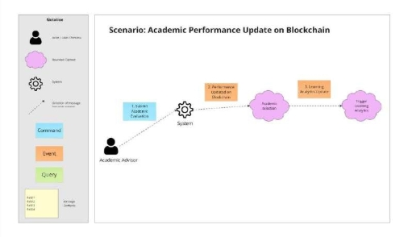
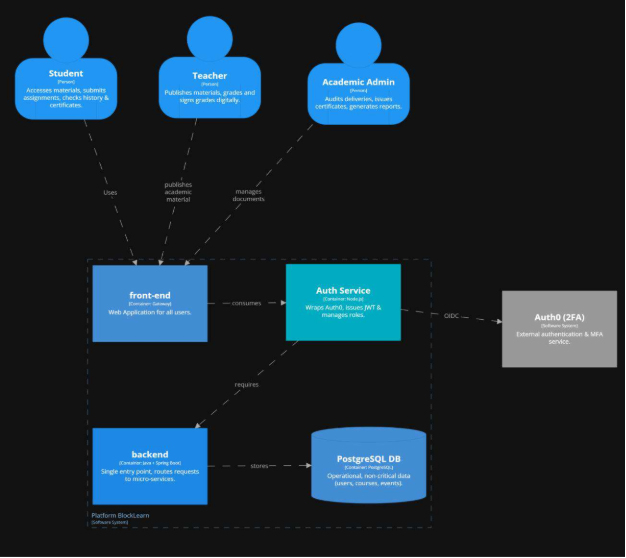

**Universidad Peruana de Ciencias Aplicadas FACULTAD DE INGENIERÍA** 

**2025-1** 

**Arquitecturas de Software Emergentes Sección:**  **Profesor: Royer Edelwer Rojas Malasquez** 
**Informe del Trabajo Final** 

**Nombre de la Startup: Bicasteam** **Nombre del Producto: BlockLearn** 

**Integrantes:** 

Huarcaya Chavez, Miguel Alejandro Daniel  - u202116207 Irigoyen Matos, Javier Sharvel - u20221d156 

Torres Espinoza, Elias - u20191A453 

Vásquez Villalobos, Elverth Jair -u202213070 Zárate Gamarra, Luis Alejandro - u20181h198 **Abril de 2025** 

**Registro de Versiones del Informe** 

En esta sección se resumen todas las modificaciones relevantes que sean realizadas sobre el informe durante el ciclo de vida del proyecto. 

|**Versió n** |**Fecha** |**Autor** |**Descripción de modificación** |
| :- | - | - | - |
|1\.0 |25/04/2025 |
Huarcaya Chavez, Miguel Alejandro   Torres Espinoza, Elias  

Vásquez Villalobos, Elverth Jair  Zárate Gamarra, Luis Alejandro  Irigoyen Matos, Javier Sharvel 
|
mplementación de diseño de entrevistas, desarrollar las entrevistas, el Impact Mapping, User Stories y Event Storming 

implementación del Capítulo entrevistas, desarrollo de Event Storming en colaboración con otros integrantes del equipo 

Desarrollo de entrevistas, implementación del Needfinding, Event Storming, User Stories, documentar la capa de dominio de los bounded contexts 

Desarrollo de entrevistas, implementación del Needfinding, desarrollo de Software Architecture, esto incluye el desarrollo del modelo C4 

Desarrollo de entrevistas, y la investigación sobre los competidores y el análisis competitivo y las 

estrategias frente a los competidores, del mismo 
|

||||modo, apoyo en el desarrollo de Tactical-Level Domain-Driven Design |
| :- | :- | :- | :- |

**Tabla de contenidos** 

[**Capítulo I: Introducción ........................................................................................................... 9**](#_page9_x69.00_y452.00)

1. [Startup Profile ................................................................................................................ 9](#_page9_x69.00_y479.00)
1. [Descripción de la Startup ....................................................................................... 9](#_page9_x69.00_y507.00)
1. [Perfiles de integrantes del equipo ......................................................................... 10](#_page10_x69.00_y72.00)
2. [Solution Profile ............................................................................................................ 12](#_page13_x69.00_y100.00)
1. [Antecedentes y problemática................................................................................. 12 ](#_page13_x69.00_y128.00)[Tabla 1. ........................................................................................................ 12](#_page13_x69.00_y155.00)
1. [Lean UX Process .................................................................................................. 14](#_page14_x69.00_y328.00)
1. [Lean UX Problem Statements...................................................................... 14](#_page14_x69.00_y355.00)
1. [Lean UX Assumptions ................................................................................ 15](#_page15_x69.00_y266.00)
1. [Lean UX Hypothesis Statements ................................................................. 15](#_page15_x69.00_y555.00)
1. [Lean UX Canvas ......................................................................................... 18 ](#_page17_x69.00_y72.00)[Tabla 2. ........................................................................................................ 18](#_page17_x69.00_y100.00)
3. [Segmento Objetivo ....................................................................................................... 26 ](#_page23_x69.00_y72.00)[**Capítulo II: Requirements Elicitation & Analysis ................................................................. 27**](#_page24_x69.00_y72.00)
1. [Competidores ............................................................................................................... 27](#_page24_x69.00_y100.00)
1. [Análisis competitivo ............................................................................................ 29 ](#_page26_x69.00_y72.00)[Tabla 3. ........................................................................................................ 29](#_page26_x69.00_y100.00)
1. [Estrategias y tácticas frente a competidores .......................................................... 32](#_page29_x69.00_y100.00)
2. Entrevistas ................................................................................................................... 34 
1. [Diseño de entrevistas ........................................................................................... 35](#_page31_x69.00_y500.00)
1. [Registro de entrevistas ......................................................................................... 37 ](#_page33_x69.00_y193.00)[Figura 1. ............................................................................................................ 38 ](#_page33_x69.00_y276.00)[Figura 2. ............................................................................................................ 40 ](#_page34_x69.00_y473.00)
1. [Análisis de entrevista ........................................................................................... 42 ](#_page36_x69.00_y72.00)
- [Análisis de entrevistas a Perfil Administrativo............................................................ 42](#_page36_x69.00_y100.00)
- [Análisis de entrevistas a Perfil Estudiante .................................................................. 42 ](#_page36_x69.00_y307.00)
3. [Needfinding .................................................................................................................. 43](#_page37_x69.00_y72.00)
1. [User Personas ...................................................................................................... 43 ](#_page37_x69.00_y100.00)[Figura 7. ............................................................................................................ 43](#_page37_x69.00_y128.00)
1. [User Task Matrix ................................................................................................. 47](#_page41_x69.00_y72.00)
- [User Journey Mapping ............................................................................................... 48 ](#_page42_x69.00_y452.00)[User Journey Mapping del User Persona Administrativo.................................... 49 ](#_page43_x69.00_y72.00)
3. [Empathy Mapping................................................................................................ 50](#_page44_x69.00_y327.00)
3. [As-is Scenario Mapp............................................................................................ 54 ](#_page48_x69.00_y72.00)
4. [Ubiquitous Language .................................................................................................... 56 ](#_page50_x69.00_y100.00)[**Capítulo III: Requirements Specification .............................................................................. 56**](#_page50_x69.00_y128.00)
1. [To-Be Scenario Mapping .............................................................................................. 56](#_page50_x69.00_y155.00)
1. [User Stories .................................................................................................................. 58 ](#_page52_x69.00_y72.00)[Tabla 4. ........................................................................................................ 58](#_page52_x69.00_y100.00)
1. [Impact Mapping ........................................................................................................... 72](#_page67_x69.00_y72.00)
1. [Product Backlog ........................................................................................................... 74 ](#_page69_x69.00_y613.00)[Tabla 6. ........................................................................................................ 75](#_page70_x69.00_y72.00)

[**Capítulo IV: Solution Software Design .................................................................................. 79**](#_page74_x68.00_y72.00)

1. [Strategic-Level Domain-Driven Design ........................................................................ 79](#_page74_x68.00_y100.00)
1. [Design Purpose .................................................................................................... 79](#_page74_x68.00_y128.00)
1. [Attribute-Driven Design Inputs ............................................................................ 80](#_page74_x68.00_y417.00)
1. [Primary Functionality (Primary User Stories) .............................................. 80](#_page74_x68.00_y445.00)
1. [Quality attribute Scenarios .......................................................................... 83](#_page77_x68.00_y488.00)
1. [Constraints .................................................................................................. 84](#_page79_x68.00_y72.00)
3. [Architectural Drivers Backlog ............................................................................... 85 ](#_page79_x68.00_y549.00)
4. [Architectural Design Decisions ............................................................................ 87 ](#_page81_x68.00_y312.00)
4. [Quality Attribute Scenario Refinements ............................................................... 89 ](#_page83_x68.00_y72.00)
2. [Strategic-Level Domain-Driven Design ......................................................................... 96 ](#_page90_x68.00_y168.00)
1. [EventStorming ..................................................................................................... 96 ](#_page90_x68.00_y196.00)
1. [Candidate Context Discovery ............................................................................ 106 ](#_page100_x68.00_y418.00)
1. [Domain Message Flows Modeling ..................................................................... 107 ](#_page101_x68.00_y141.00)
1. [Bounded Context Canvases .............................................................................. 110 ](#_page103_x68.00_y335.00)
1. [Context Mapping ............................................................................................... 112 ](#_page104_x68.00_y672.00)
3. [Software Architecture ................................................................................................. 114 ](#_page107_x68.00_y72.00)
1. [Software Architecture System Landscape Diagram ........................................... 114 ](#_page107_x68.00_y100.00)
1. [Software Architecture Context Level Diagrams .................................................. 115 ](#_page108_x68.00_y72.00)
1. [Software Architecture Container Level Diagrams ............................................... 116 ](#_page109_x68.00_y72.00)
1. [Software Architecture Deployment Diagrams..................................................... 116 ](#_page109_x68.00_y662.00)

[**Conclusiones .......................................................................................................................... 116 ](#_page111_x68.00_y72.00)**Video About-the-team ........................................................................................................... 118 [Bibliografía ............................................................................................................................ 118** ](#_page112_x68.00_y72.00)[Anexos ................................................................................................................................... 119**](#_page113_x68.00_y72.00)**

**Student Outcome** 

El  curso  contribuye  al  cumplimiento  del  Student  Outcome  ABET:  ABET  – EAC  -  Student Outcome 3. Criterio: Capacidad de comunicarse efectivamente con un rango de audiencias. En el siguiente cuadro se describen las acciones realizadas y enunciados de conclusiones por parte del grupo, que permiten sustentar el haber alcanzado el logro del ABET – EAC - Student Outcome 3. 

<table><tr><th colspan="1" valign="top"><b>Criterio Específico</b> </th><th colspan="1" valign="top"><b>Acciones Realizadas</b> </th><th colspan="1" valign="top"><b>Conclusiones</b> </th></tr>
<tr><td colspan="1" rowspan="3" valign="top">
Comunica oralmente sus ideas 

y/o resultados con objetividad a público de diferentes especialidades y niveles 

jerárquicos, en el marco del 

desarrollo de un proyecto en ingeniería 
</td><td colspan="1" valign="top">
Luis Alejandro Zárate Gamarra 

<b>TB1:</b> Inicié el avance conjunto para el desarrollo del desarrollo del Event Storming, descripción de comandos, eventos, mapeo de contextos y visualización de mapas adicionales de forma óptima. 
</td><td colspan="1" rowspan="3" valign="top">
<b>TB1</b>: 

El liderazgo conjunto permitió la distribución adecuada de tareas, facilitando la consecución de los objetivos del proyecto de manera efectiva. La correcta supervisión, mediación y comunicación aseguraron que todos los miembros estuvieran alineados y motivados 
</td></tr>
<tr><td colspan="1" valign="top">
Miguel Huarcaya Chavez 

<b>TB1</b>:Propuse el avance conjunto para el desarrollo de los 

puntos críticos del desarrollo del informe, tales como 

el capítulo 4, el desarrollo del Event Storming, las 

cuales se desarrolló con éxito 
</td></tr>
<tr><td colspan="1" valign="top">
Elias Torres Espinoza 

<b>TB1</b> 

Fomenté la participación activa lo que ayudó en la 
</td></tr>
</table>

<table><tr><th colspan="1" valign="top"><b>Criterio Específico</b> </th><th colspan="1" valign="top"><b>Acciones Realizadas</b> </th><th colspan="1" valign="top"><b>Conclusiones</b> </th></tr>
<tr><td colspan="1" rowspan="3"></td><td colspan="1" valign="top">
toma de decisiones clave para el proyecto. Del 

mismo modo para el desarrollo óptimo de los 

bounded contexts, los cuales son fundamentales 

para dividir las funcionalidades principales de la 

aplicación por módulos 
</td><td colspan="1" rowspan="3"></td></tr>
<tr><td colspan="1" valign="top">
Elverth Jair Vásquez Villalobos 

<b>TB1</b> 

Coordiné el uso de herramientas colaborativas y promoví la comunicación constante en el equipo. Del mismo modo, me encargué de realizar el Tactical-Level Domain- Driven Design lo que nos permite tener una visión más clara de la estructur  de la aplicación y de cómo se relacionan los diferentes módulos 
</td></tr>
<tr><td colspan="1">
Irigoyen Matos, Javier Sharvel 

<b>TB1:</b>Durante el desarrollo del proyecto, expuse de manera clara y estructurada el diseño de las épicas y las historias de usuario, explicando cómo cada una responde a las necesidades detectadas en los diferentes perfiles de usuarios. 
</td></tr>
</table>

<table><tr><th colspan="1" valign="top"><b>Criterio Específico</b> </th><th colspan="1" valign="top"><b>Acciones Realizadas</b> </th><th colspan="1" valign="top"><b>Conclusiones</b> </th></tr>
<tr><td colspan="1"></td><td colspan="1" valign="top">Además, presenté los escenarios futuros (TO-BE) para estudiantes, docentes y administradores, mostrando la transformación de la experiencia del usuario en la plataforma BlockLearn. Finalmente, sustenté el diagrama de despliegue de la arquitectura del sistema, explicando de forma sencilla la interacción entre usuarios, la aplicación, el backend, la base de datos y la blockchain. </td><td colspan="1"></td></tr>
<tr><td colspan="1" rowspan="2" valign="top">
Comunica en forma escrita ideas 

y/o resultados con objetividad a público de diferentes especialidades y niveles 

jerarquicos, en el marco del 

desarrollo de un proyecto en ingeniería. 
</td><td colspan="1" valign="top">
Elias Torres Espinoza 

<b>TB1</b>: Facilité el uso de herramientas colaborativas y 

organicé sesiones para revisar el progreso del 

equipo, tales como reuniones en Discord, además 

de diseñar modelos de dominio y de arquitectura que 

permitieron una mejor comprensión de la solución 
</td><td colspan="1" rowspan="2" valign="top">
<b>TB1</b>: 

El ambiente inclusivo, la colaboración y la correcta planificación permitieron al equipo cumplir con los objetivos del proyecto de manera efectiva, optimizando los recursos y maximizando la eficiencia del trabajo en equipo. La cohesión y la revisión constante aseguraron que todos los miembros estuvieran alineados con los objetivos finales 
</td></tr>
<tr><td colspan="1" valign="top">
Javier Sharvel Irigoyen Matos 

<b>TB1</b> 

Redacté la documentación relacionada a las épicas y las historias de usuario, detallando los escenarios de aceptación de cada funcionalidad en un lenguaje claro y estructurado. También elaboré los escenarios TO-BE de los tres 
</td></tr>
</table>

<table><tr><th colspan="1" valign="top"><b>Criterio Específico</b> </th><th colspan="1" valign="top"><b>Acciones Realizadas</b> </th><th colspan="1" valign="top"><b>Conclusiones</b> </th></tr>
<tr><td colspan="1" rowspan="3"></td><td colspan="1" valign="top">perfiles de usuario (estudiante, docente y administrador), describiendo de manera ordenada la experiencia esperada. Finalmente, documenté el diagrama de despliegue de la arquitectura de BlockLearn, explicando los componentes y su interacción de forma entendible para distintos públicos. </td><td colspan="1" rowspan="3"></td></tr>
<tr><td colspan="1" valign="top">
Elverth Jair Vásquez Villalobos 

<b>TB1</b> 

Promoví la cohesión del equipo y facilitó la toma de decisiones consensuada para cumplir con los objetivos establecidos. Del mismo modo, se realizaron entrevistas y se recopiló información para el desarrollo de la solución. 
</td></tr>
<tr><td colspan="1" valign="top">
Miguel Huarcaya Chavez 

<b>TB1</b>: Supervisé el cumplimiento de los plazos y fomentó 

un entorno inclusivo al involucrar a todos los 

miembros en la revisión de avances, lo que nos 

permitió corregir errores y mejorar características de 
</td></tr>
</table>

<table><tr><th colspan="1" valign="top"><b>Criterio Específico</b> </th><th colspan="1" valign="top"><b>Acciones Realizadas</b> </th><th colspan="1" valign="top"><b>Conclusiones</b> </th></tr>
<tr><td colspan="1" rowspan="2"></td><td colspan="1" valign="top">nuestra solución. </td><td colspan="1" rowspan="2"></td></tr>
<tr><td colspan="1" valign="top">
Zarate Gamarra Luis Alejandro 

TB1: Realicé revisiones periódicas para concretar el desarrollo de los puntos distribuidos. Asimismo, se concretaron los puntos y limitaciones para abordar el desarrollo del flujo de procesos que tendrá el sistema. 
</td></tr>
</table>
**Capítulo I: Introducción** 

1. **Startup Profile** 
1. **Descripción de la Startup** 

BlockLearn es un sistema de gestión de información basado en tecnología blockchain, diseñado para optimizar la administración, distribución y seguridad de los recursos educativos en institutos técnicos privados del Perú. 

Este sistema busca centralizar la información educativa, automatizar procesos administrativos, planificar académicamente y distribuir contenidos de forma segura, trazable y eficiente. Está especialmente pensado para abordar problemas como la fragmentación tecnológica, la falta de plataformas integradas y la limitada infraestructura en estos institutos 

2. **Perfiles de integrantes del equipo** 

|**Integrante** |Huarcaya Chavez, Miguel Alejandro Daniel |
| - | :-: |
|**Código del Estudiante** |u202116207 |
|**Carrera** |Ingeniería de Software |
|Soy estudiante de 8mo ciclo. Cuento con conocimientos en JavaScript, TypeScript, HTML, CSS, Vue y Angular. Soy una persona responsable y colaborativa. ||

|**Integrante** |Torres Espinoza, Elias |
| - | - |
|**Código del Estudiante** |u20191A453 |
|**Carrera** |Ingeniería de Software |

|Actualmente soy de 8 ciclo en la Universidad Peruana de Ciencias Aplicadas, cuento con conocimientos en Angular, vue, TypeScript, JavaScript ,C++, C#, Python, flutter,  HTML y css. ||
| - | - |

|**Integrante** |Vásquez Villalobos, Elverth Jair |
| - | - |
|**Código del Estudiante** |u202213070 |
|**Carrera** |Ingeniería de Software |
|Soy Elverth Jair, tengo 20 años, estudiante de la carrera de Ingeniería de Software, tengo habilidades en el desarrollo web, tanto en el frontend como en el backend. Me gusta aprender cosas nuevas y apoyar a mis compañeros en lo que necesiten. Me considero una persona responsable, proactiva y con muchas ganas de aprender. ||

|**Integrante** |Zárate Gamarra, Luis Alejandro |
| - | - |
|**Código del Estudiante** |u20181h198 |
|**Carrera** |Ingeniería de Software |

|Mi nombre es Alejandro, actualmente curso el 8vo ciclo de la carrera de Ingeniería de Software. Tengo experiencia en programación con lenguajes como Python, JavaScript y Java, y he trabajado con frameworks como React y tecnologías como .NET. Me considero una persona responsable, proactiva y con un fuerte compromiso por seguir aprendiendo y superándome constantemente en el ámbito profesional y personal. ||
| :- | - |

|**Integrante** |Irigoyen Matos, Javier Sharvel  |
| - | - |
|**Código del Estudiante** |u20221d156 |
|**Carrera** |Ingeniería de Software |
|Mi nombre es Javier Irigoyen, estudié la carrera de Física en la PUCP y actualmente me encuentro en 8vo ciclo en la UPC (Universidad Peruana de Ciencias) con la carrera de Ingeniería de Software. Siempre me ha interesado la ciencia y tecnología y en desarrollar aplicaciones que automaticen procesos con la ayuda de la IA. Me considero una persona optimista, responsable y autodidacta. ||

2. **Solution Profile** 
1. **Antecedentes y problemática** 

**Tabla 1.** 

Presentación del modelo de las preguntas 5Ws y 2Hs con la que se analizaron los antecedentes y la problemática que abarca nuestro proyecto. 

|Las 5Ws y 2Hs |Pregunta |Descripción |
| :-: | - | - |
|What? |¿Cuál es el problema? |Hay una gestión deficiente de los recursos educativos en institutos técnicos privados del Perú. Esto incluye la centralización excesiva de información, plataformas no integradas, poca trazabilidad, y una infraestructura tecnológica limitada. |
|When? |¿Cuándo estamos  viendo el problema? |Este problema ha sido persistente, pero se intensificó tras la pandemia y continúa afectando el ciclo educativo actual (según los datos, hasta 2024). |
|Where? |¿Dónde estamos  viendo los problemas? |En institutos técnicos privados del Perú, específicamente aquellos como Zegel e IDAT, que enfrentan dificultades para gestionar eficientemente sus operaciones académicas y administrativas |
|Who? |¿A quién le sucede? |Los beneficiarios principales son estudiantes, docentes y administrativos de los institutos técnicos. |
|Why? |¿Por qué sucede el  problema? |
Infraestructura tecnológica obsoleta. 

Falta de plataformas integradas. 

Ausencia de políticas claras de digitalización. Resistencia al cambio tecnológico y falta de capacitación en nuevas tecnologías como blockchain. 
|
|How? |
¿Cómo se diferencia el problema del estado  

normal (óptimo)? 
|
- Pérdida y retraso de información. 

- Desigualdad en el acceso a materiales educativos. 

- Ineficiencia operativa, con mayor consumo de energía y mayor costo administrativo. 

- Falta de confianza en la validez de certificados y procesos académicos. 
|

|||
- Desmotivación y deserción estudiantil. 

- Desempleo juvenil, por no estar alineados con lo que el mercado laboral exige. 
|
| :- | :- | - |
|How Much? |¿Cuánto es el impacto financiero? |
- Altos costos operativos por mantener procesos manuales y plataformas no integradas. 

- Disminución de ingresos: La deserción y baja matrícula generan menores ingresos (en 2023- 2024, el total estimado de ingresos de Zegel e IDAT fue S/ 10,200 mil, que podría verse afectado por estos problemas). 

- Mayor gasto energético por sistemas ineficientes. 

- Pérdida de competitividad en el mercado educativo. 
|
2. **Lean UX Process** 
1. **Lean UX Problem Statements** 

**Problem Statement:** 

Los institutos técnicos privados del Perú, como Zegel e IDAT, no cuentan con una plataforma tecnológica eficiente que permita una gestión integrada y segura de los recursos educativos, lo que genera desorganización, pérdida de información y baja calidad educativa. 

**Problema**:  

La gestión actual de información y recursos educativos está fragmentada, centralizada en exceso y no es trazable. Esto provoca retrasos en procesos administrativos, desactualización de materiales, riesgos de pérdida de datos y poca eficiencia operativa. 

**Impacto:** 

Estudiantes: reciben una educación de menor calidad y tienen menos acceso a recursos actualizados, afectando su formación y empleabilidad. 

Docentes y administrativos: pierden tiempo en tareas manuales y carecen de herramientas efectivas para planificar y distribuir contenidos. 

Instituciones: enfrentan mayores costos operativos, baja satisfacción de usuarios y pérdida de competitividad frente a otras opciones educativas. 

2. **Lean UX Assumptions** 
- Los usuarios (docentes y administrativos) no tienen acceso a una plataforma unificada para la planificación académica y distribución de contenidos. 
- Los estudiantes tienen dificultades para acceder a materiales educativos actualizados de forma rápida y segura. 
- La institución no cuenta con trazabilidad confiable de datos educativos, lo cual afecta la transparencia y la toma de decisiones. 
- Los usuarios aceptarían una nueva plataforma tecnológica si esta es intuitiva, accesible y mejora su experiencia. 
- El uso de blockchain como tecnología base mejorará la seguridad y confianza en el sistema de gestión educativa. 
- Los recursos actuales (infraestructura, tiempo, personal) son suficientes para un piloto funcional si se capacita correctamente a los usuarios. 
3. **Lean UX Hypothesis Statements** 
- Creemos que una plataforma integrada con blockchain para administrativos de institutos técnicos logrará optimizar la planificación académica y la asignación de recursos porque permitirá centralizar procesos dispersos y evitar la duplicación de esfuerzos. 
- Creemos que capacitar a docentes en el uso de la plataforma para que la integren en su trabajo diario logrará una mayor adopción tecnológica y eficiencia en la enseñanza porque reducirá su resistencia al cambio y aumentará su confianza en las herramientas digitales. 
- Creemos que ofrecer a los estudiantes acceso seguro y personalizado a materiales educativos para que estudien desde cualquier lugar logrará mejorar su rendimiento y satisfacción porque tendrán más autonomía y acceso constante a recursos actualizados. 
- Creemos que registrar los datos académicos en blockchain para docentes y administrativos logrará aumentar la transparencia y trazabilidad de la información educativa porque esta tecnología garantiza inmutabilidad y verificación descentralizada. 
- Creemos que implementar dashboards con analítica de datos educativos para directivos y gestores académicos logrará tomar mejores decisiones estratégicas porque contarán con información clara, en tiempo real y basada en métricas confiables. 
- Creemos que permitir el acceso a historiales académicos verificables en la plataforma para empleadores y egresados logrará incrementar la empleabilidad de los alumnos porque se reducirá la desconfianza en certificados y se validarán competencias rápidamente. 
- Creemos que reducir la dependencia de infraestructura tecnológica obsoleta para las instituciones educativas logrará disminuir costos operativos y consumo energético porque el sistema estará optimizado en la nube y utilizará recursos más eficientes. 

4. **Lean UX Canvas** 

**Tabla 2.** 

Modelo del Lean UX Canvas diseñado para el proyecto 

|
**1) Business problem** 

Los institutos técnicos privados del Perú, como Zegel e IDAT, están enfrentando una ineficiencia crítica en la gestión y distribución de sus recursos educativos, lo cual está generando costos operativos elevados, baja satisfacción de usuarios (estudiantes y docentes), y pérdida de competitividad en el sector educativo. 

**Procesos administrativos descentralizados y manuales,** que consumen más tiempo del necesario y son propensos a errores.** 

**Falta de trazabilidad y seguridad en los datos académicos**, lo cual afecta la 
|
**5) Solution ideas** 

**Plataforma  web  integrada  de  gestión académica** 

- Paneles diferenciados para docentes, estudiantes y administrativos. 

- Compatible  con  computadoras  y móviles. 

**Uso de tecnología blockchain** 

- Para  garantizar  la  trazabilidad, seguridad  y  verificación  de  datos académicos como  notas, matrículas, certificados, etc. 
|
**2) Business outcomes** 

**Reducción  del  30%  en  los  costos operativos  administrativos**,  gracias  a  la automatización de procesos y la eliminación de redundancias tecnológicas. 

**Incremento del 25% en la satisfacción de estudiantes  y  docentes**,  mediante  una experiencia más fluida, segura y accesible en la gestión académica. 

**Disminución  del  40%  en  el  tiempo  de planificación  y  distribución  de  recursos educativos,**  gracias  a  la  centralización  y trazabilidad de los datos. 

**Mejora de la transparencia institucional,** fortaleciendo  la  confianza  de  estudiantes, 
|
| - | - | - |

<table><tr><th colspan="1" valign="top">
transparencia institucional y genera desconfianza.</b> 

<b>Plataformas tecnológicas fragmentadas</b> que no se comunican entre sí, provocando redundancia de esfuerzos, confusión y pérdida de información.</b> 

<b>Desigualdad en el acceso a contenidos educativos,</b> especialmente en regiones con menor infraestructura, lo que impacta negativamente en la experiencia estudiantil.</b> 

<b>Pérdida de ingresos potenciales</b> debido a la deserción estudiantil y a la baja percepción de valor por parte de nuevos postulantes y empleadores. 
</th><th colspan="1" rowspan="2" valign="top">
<b>Sistema  de  planificación  académica inteligente</b> 

- Herramienta  para  asignar  horarios, recursos, aulas y docentes de forma automática o asistida. 

<b>Repositorio  de  contenidos  educativos digitales</b> 

- Accesible  por  niveles,  materias  y roles,  con  permisos  seguros  y adaptables a cada usuario. 

<b>Dashboard con analítica educativa</b> 

- Reportes  en  tiempo  real  sobre asistencia,  rendimiento,  uso  de  la plataforma y gestión de recursos. 

<b>Sistema de notificaciones y comunicación interna</b> 
</th><th colspan="1" valign="top">
empleadores y entes reguladores mediante el uso de blockchain<b>.</b> 

<b>Aumento  en  la  tasa  de  retención estudiantil,</b>  al  ofrecer  una  plataforma moderna  que  mejora  la  experiencia  de aprendizaje. 

<b>Fortalecimiento  del  posicionamiento competitivo</b> en el sector educativo técnico, al  ofrecer  servicios  diferenciados  por  su eficiencia tecnológica. 
</th></tr>
<tr><td colspan="1" valign="top">
<b>3) User and customers</b> 

Son  quienes  utilizarán  directamente  la plataforma en su día a día: 

<b>Docentes</b> 
</td><td colspan="1" valign="top">
<b>4) User benefits</b> 

<b>Para los docentes:</b> 

●  Ahorro  de  tiempo  en  planificación 

académica y gestión de notas. 
</td></tr>
</table>

|
- Usan  la  plataforma  para  planificar clases, acceder a contenidos, registrar notas y comunicarse con estudiantes. 

- Necesitan  herramientas  fáciles  de usar,  seguras  y  adaptadas  a  su dinámica pedagógica. 

**Estudiantes** 

- Acceden  a  materiales  educativos, revisan  su  historial  académico  y reciben notificaciones o tareas. 

- Buscan una experiencia ágil, segura y que les permita aprender en cualquier momento y lugar. 

**Administrativos académicos** 

- Planifican horarios, asignan recursos, gestionan matrículas y registros. 

- Requieren  eficiencia,  trazabilidad  y reducción de carga operativa. 
|
- Alertas para tareas, eventos, cambios de horarios, etc., mediante correo o app. 

**Capacitación  digital  para  docentes  y administrativos** 

- Módulos interactivos para aprender a usar  la  plataforma  y  aprovechar blockchain. 
|
- Acceso centralizado a contenidos y recursos actualizados. 

- Menor carga administrativa, lo que les  permite  enfocarse  más  en  la enseñanza. 

- Mayor  seguridad  en  el  manejo  de datos académicos. 

**Para los estudiantes:** 

- Acceso rápido y seguro a materiales educativos  desde  cualquier dispositivo. 

- Mayor  transparencia  sobre  su historial académico y evaluaciones. 

- Reducción de brechas de acceso para estudiantes  en  zonas  con infraestructura limitada. 

- Mejor  experiencia  de  aprendizaje, más  organizada  y  con  recursos personalizados. 

**Para el personal administrativo:** 
|
| - | - | :- |

|||
- Automatización  de  procesos rutinarios, como asignación de aulas, horarios o matrículas. 

- Trazabilidad  completa  de  la información académica y operativa. 

- Menor  probabilidad  de  errores  y pérdida de datos. 

- Control centralizado y en tiempo real de la infraestructura educativa. 
|
| :- | :- | - |
|
**6) Hypotheses** 

Creemos que una plataforma integrada con blockchain para docentes y administrativos logrará  reducir  errores  y  tiempos  en  la gestión  académica  porque  automatiza procesos y garantiza trazabilidad de datos. 

Creemos  que  ofrecer  acceso  seguro  y centralizado  a  materiales  para  estudiantes logrará mejorar su experiencia y rendimiento porque  podrán  acceder  a  contenidos actualizados desde cualquier dispositivo. 
|
**7) What’s the most important thing we need to learn first?** 

Porque si los usuarios no entienden o confían en los beneficios del blockchain, la solución perdería  valor,  sin  importar  su  potencial técnico. 

Porque la adopción es clave para el impacto: sin  uso  activo,  no  se  generan  mejoras  ni beneficios tangibles. 

Porque  la  percepción  de  complejidad tecnológica puede convertirse en una barrera de entrada. 
|
**8) What’s the least amount of work we need to do to learn the next most important thing?** 

**1. Entrevistas con usuarios clave** 

Realizar entrevistas breves (15-20 minutos) con: 

- Docentes 

- Estudiantes 

- Administrativos 

**Objetivo:** Explorar su conocimiento actual sobre plataformas de gestión educativa, sus 
|

|
Creemos que capacitar a los usuarios en el uso del sistema para facilitar su adopción logrará mayor eficiencia y menor resistencia al cambio porque se sentirán preparados y verán valor en la herramienta 

Creemos que mostrar analíticas educativas en  tiempo  real  para  directivos  logrará mejorar  la  toma  de  decisiones  porque tendrán una visión clara y basada en datos. 

Creemos  que  registrar  información académica en blockchain para empleadores y estudiantes logrará aumentar la confianza en  certificados  y  logros  porque  se  podrá verificar  la  autenticidad  de  los  datos  sin intermediarios.** 
||
dolores actuales, y su percepción sobre el uso de blockchain (seguridad, trazabilidad, etc.). 

2. **Encuesta validada con escenarios de uso** 

Diseñar  una  encuesta  digital  con  6-8 preguntas que incluya: 

- Problemas actuales que enfrentan 

- Valoración  de  características propuestas 

- Reacciones a una breve explicación del uso de blockchain en educación 

- Intención de uso si se implementara en su instituto 

3. **Prototipo interactivo de baja fidelidad (wireframe clickable)** 

&emsp;Crear una versión navegable muy básica de la interfaz:** 

- Muestra  flujos  clave  como  login, consulta  de  contenidos,  historial 
|
| - | :- | - |

|||
académico  y  certificados  en blockchain. 

- Usar Figma o MarvelApp para que los  usuarios  interactúen  y  den feedback inmediato. 

**4.  Validación  rápida  en  un  piloto controlado** 

Implementar un MVP funcional solo para un curso o área en un instituto técnico aliado (como IDAT o Zegel).** 

- Monitorear  uso,  adopción  y comentarios por 2 semanas. 

- Medir:  tasa  de  acceso, retroalimentación, errores reportados y satisfacción. 
|
| :- | :- | :- |

3. **Segmento Objetivo** 

**Institutos técnicos privados del Perú** 

- Mencionados específicamente como el foco del sistema (Zegel, IDAT). 
- Necesitan mejorar la gestión de recursos educativos, distribución de contenidos y planificación académica 

**Docentes** 

- Usuarios que se beneficiarán de una plataforma que les permita una mejor planificación académica y acceso a materiales educativos actualizados. 
- Se espera que tengan una experiencia más fluida e intuitiva 

**Estudiantes** 

- Beneficiarios principales en términos de acceso igualitario a contenidos, trazabilidad de logros académicos y mejora en la empleabilidad. 
- El sistema busca responder a sus necesidades de formación técnica alineada con el mercado laboral 

**Capítulo II: Requirements Elicitation & Analysis** 

1. **Competidores** 

**BLOCKCERTS:** 

Blockcerts es una solución open‑source desarrollada por el MIT que permite la emisión y verificación de diplomas digitales mediante tecnología blockchain. Su plataforma ofrece un estándar de credenciales interoperables que garantiza la inmutabilidad de los registros académicos y facilita a empleadores e instituciones la validación automática de certificados sin necesidad de intermediarios. Aunque está orientada principalmente a la gestión de diplomas, su robustez en trazabilidad la convierte en un referente para aplicaciones que requieren alta integridad de documentos educativos  

. 

**EDUCTX:** 

EduCTX se centra en la administración de créditos académicos en instituciones de educación superior, utilizando blockchain para registrar, transferir y verificar créditos de manera segura y transparente. Su enfoque en la movilidad estudiantil y la estandarización de créditos facilita convenios interinstitucionales, pero carece de funciones específicas para la gestión de sílabos y evaluaciones diarias, lo que limita su alcance en plataformas de gestión integral de recursos educativos  

. 

**BCDIPLOMAS:** 

BCDiplomas ofrece una herramienta para emitir credenciales académicas digitales verificables, combinando blockchain con una interfaz sencilla para emisores y verificadores. Su fortaleza radica en la facilidad de integración con sistemas existentes y la capacidad de personalizar plantillas de certificación. Sin embargo, al enfocarse exclusivamente en credenciales, no aborda flujos de trabajo asociados a la distribución y actualización de sílabos o evaluaciones, dejándolos fuera de su propuesta de valor

1. **Análisis competitivo** 

**Tabla 3.** 

Análisis Competitivo organizado para todos los competidores potenciales 

|` `Competitive Analysis Landscape |||||||
| - | :- | :- | :- | :- | :- | :- |
|¿Por qué llevar a cabo este análisis? |El objetivo de este análisis es investigar a detalle las características principales y las propuestas de valor que ofrecen otras soluciones basadas en blockchain para la gestión de documentos académicos, de modo que podamos identificar oportunidades de diferenciación y posicionar nuestra plataforma de manera competitiva. ||||||
|Empresas |||||||
|Perfil |Overview |Plataforma web integral que gestiona sílabos, certificados y evaluaciones en institutos superiores de Lima, con trazabilidad blockchain y smart contracts. |Solución open‑source del MIT para emitir y verificar diplomas digitales mediante blockchain, con un estándar de credenciales interoperables. |Plataforma blockchain para registro y transferencia de créditos académicos, enfocada en la movilidad estudiantil. |Servicio SaaS para emitir credenciales académicas digitales verificables, con plantillas personalizables y APIs de integración. ||

<table><tr><th colspan="1"></th><th colspan="1" valign="top">
Ventaja 

competitiva  
</th><th colspan="1">Integra tres tipos de recursos académicos en un único sistema con trazabilidad end‑to‑end y auditorías automatizadas. </th><th colspan="1" valign="top">Respaldo académico del MIT y comunidad open‑source; alto grado de interoperabilidad. </th><th colspan="1" valign="top">Especialización en créditos académicos y soporte a convenios interinstitucionales. </th><th colspan="1" valign="top">Fácil integración con sistemas existentes y personalización de diseños de diplomas. </th></tr>
<tr><td colspan="1" rowspan="2" valign="top">
Perfil de 

Marketing 
</td><td colspan="1" valign="top">
Mercado 

objetivo 
</td><td colspan="1">Institutos de educación superior (administradores, docentes y personal de registro académico) en Lima. </td><td colspan="1" valign="top">Universidades, colegios y empleadores que requieren verificación de diplomas. </td><td colspan="1" valign="top">Instituciones de educación superior que gestionan convenios de créditos y movilidad. </td><td colspan="1" valign="top">Instituciones educativas y corporaciones que emiten certificados y micro‑credenciales. </td></tr>
<tr><td colspan="1" valign="top">
Estrategias de 

marketing 
</td><td colspan="1">Contenido técnico en blogs académicos, webinars con instituciones, alianzas con gremios educativos y presencia en ferias universitarias. </td><td colspan="1">Publicación en conferencias académicas, colaboraciones con laboratorios de investigación y repositorio público en GitHub. </td><td colspan="1">Participación en foros de movilidad académica, convenios con asociaciones de universidades y publicaciones en revistas de educación. </td><td colspan="1" valign="top">Marketing directo a universidades, partnerships con proveedores de LMS y demostraciones personalizadas. </td></tr>
<tr><td colspan="1" rowspan="2" valign="top">
Perfil de 

Producto 
</td><td colspan="1" valign="top">
Productos & 

Servicios 
</td><td colspan="1">Panel de control en tiempo real, generación y distribución de documentos, auditorías automáticas, notificaciones y APIs REST para integraciones. </td><td colspan="1" valign="top">Librerías y herramientas CLI/API para emitir y verificar credenciales blockchain. </td><td colspan="1" valign="top">Módulos de registro, transferencia y verificación de créditos académicos en ledger distribuido. </td><td colspan="1" valign="top">Portal web y APIs para emisión y validación de diplomas digitales, con dashboard de administración. </td></tr>
<tr><td colspan="1" valign="top">
Precios y 

Costos 
</td><td colspan="1">Suscripción anual escalable según número de alumnos e institutos, con niveles Básico, Profesional y Enterprise. </td><td colspan="1" valign="top">Gratuito como software, costes asociados a infraestructura blockchain y servicios de hosting. </td><td colspan="1">Modelo de membresía institucional sin tarifa por usuario; costos por nivel de servicio y personalización. </td><td colspan="1" valign="top">Tarifa por diploma emitido más suscripción mensual para acceso a dashboard y soporte. </td></tr>
</table>

<table><tr><th colspan="1"></th><th colspan="1" valign="top">
Canales de 

distribución  
</th><th colspan="1" valign="top">Sitio web oficial, integraciones directas vía API. </th><th colspan="1" valign="top">Repositorio GitHub (open‑source), Docker Hub para contenedores. </th><th colspan="1">Portal web de EduCTX y acuerdos con universidades para implementación on‑premise o en la nube. </th><th colspan="1">Plataforma SaaS accesible desde navegadores y APIs REST; marketplace de partners tecnológicos. </th></tr>
<tr><td colspan="1" rowspan="4" valign="top">
Análisis 

SWOT 
</td><td colspan="1" valign="top">Fortalezas </td><td colspan="1">
- Cobertura de múltiples tipos de recursos. 

- Smart contracts para automatización. 

- Interfaz unificada y métricas en tiempo real. 
</td><td colspan="1" valign="top">
- Estándar abierto 

respaldado por MIT. 

- Gran comunidad de 

desarrolladores. 

- Alta interoperabilidad. 
</td><td colspan="1">
- Enfoque en la movilidad de créditos. 

- Adopción en varias universidades. 

- Soporte a convenios académicos. 
</td><td colspan="1">
- Fácil personalización 

de diplomas. 

- Integración ágil con 

sistemas existentes. 

- Dashboard sencillo de 

usar. 
</td></tr>
<tr><td colspan="1" valign="top">Debilidades </td><td colspan="1">
- Carácter piloto, marca aún poco conocida. 

- Requiere adopción de infraestructura blockchain en la institución. 
</td><td colspan="1" valign="top">• Solo cubre diplomas; no gestiona sílabos ni evaluaciones. </td><td colspan="1" valign="top">• Limitado a créditos; no gestiona otros recursos académicos. </td><td colspan="1">• Enfocado únicamente en certificados; carece de módulos de gestión curricular y evaluaciones. </td></tr>
<tr><td colspan="1" valign="top">Oportunidades </td><td colspan="1">
- Expansión a otras ciudades y regiones. 

- Adición de módulos de analítica avanzada y aprendizaje automático. 
</td><td colspan="1" valign="top">• Extender soporte a certificaciones de micro‑credenciales y badges. </td><td colspan="1" valign="top">• Incluir gestión de sílabos y evaluaciones para ampliar mercado. </td><td colspan="1" valign="top">• Desarrollar módulos de planificación curricular y seguimiento de evaluaciones. </td></tr>
<tr><td colspan="1" valign="top">Amenazas </td><td colspan="1">
- Competidores consolidados en blockchain educativo. 

- Barreras regulatorias sobre datos académicos. 
</td><td colspan="1" valign="top">• Proyectos “fork” o forks privados que personalicen la solución. </td><td colspan="1" valign="top">• Plataformas propietarias de gestión académica con mayor cuota de mercado. </td><td colspan="1" valign="top">• Nuevas soluciones de blockchain LMS que integren diplomación y evaluaciones. </td></tr>
</table>

2. **Estrategias y tácticas frente a competidores** 

Se presenta un análisis del panorama competitivo en el que opera Block Learn , junto con una serie de estrategias y tácticas preliminares diseñadas para enfrentar a los competidores, maximizar el valor para los clientes y posicionar a la startup para el éxito a largo plazo. Al centrarse en la diferenciación, la adaptabilidad, la penetración en el mercado y la colaboración estratégica, Block Learn puede consolidar su posición como líder innovador en el sector de gestión de recursos educativos basados en blockchain. 

1. **Diferenciación de Producto** 

**Estrategia:** Resaltar la integración única de sílabos, certificados y evaluaciones en un mismo sistema con trazabilidad end‑to‑end y automatización mediante smart contracts. **Tácticas:**  

- Crear campañas de marketing y contenidos centrados en casos de uso reales que muestran la inmutabilidad y auditabilidad de los documentos. 
- Ofrecer demostraciones en vivo y periodos de prueba gratuitos para que las instituciones puedan validar la integridad de los recursos académicos. 
2. **Mejora Continua y Adaptación** 

**Estrategia:** Mantener un ciclo de desarrollo ágil con iteraciones frecuentes que respondan rápidamente a las necesidades de usuarios e instituciones. 

**Tácticas:**  

- Establecer un canal directo de retroalimentación (foro en línea, encuestas dentro de la aplicación) para recopilar sugerencias y prioridades de mejora. 
- Monitorizar métricas de uso (tiempos de consulta, volumen de transacciones) y realizar ajustes semanales en la plataforma. 
3. **Penetración de Mercado:**  

**Estrategia:** Expandir la adopción institucional y aumentar la cuota de mercado a través de visibilidad en académicos y eventos del sector educativo. 

**Tácticas:**  

- Implementar campañas de marketing digital segmentadas en redes profesionales de educación (LinkedIn, asociaciones universitarias). 
- Participar en congresos y ferias de tecnología educativa para presentar pilotos y casos de éxito. 
4. **Colaboración y Alianzas Estratégicas:**  

**Estrategia:** Forjar alianzas con organizaciones complementarias para enriquecer la oferta y acelerar la adopción. 

**Tácticas:**  

- Integrar la plataforma con LMS y ERP académicos mediante partnerships con proveedores como Moodle o SAP. 
- Promover convenios con gremios de universidades e institutos para facilitar pruebas piloto y descargas institucionales. 
5. **Optimización de Costos y Valor Percibido:**  

**Estrategia:** Ofrecer una propuesta de valor clara que combine características avanzadas con un esquema de precios competitivo y transparente. 

**Tácticas:**  

- Realizar análisis de precios comparativos frente a competidores de blockchain educativo para ajustar niveles de suscripción (Básico, Professional, Enterprise). 
- Introducir descuentos por volumen (número de estudiantes o facultades) y planes anuales que incentiven la fidelización. 
6. **Desarrollo de Nuevas Funcionalidades y Servicios:**  

**Estrategia:** Mantener la vanguardia tecnológica incorporando servicios de analítica, IA y verificación remota. 

**Tácticas:**  

- Realizar estudios de mercado y análisis de tendencias (p. ej. e‑learning, micro‑credenciales) para identificar necesidades emergentes. 
- Priorizar el desarrollo de módulos como dashboard de insights académicos, verificación biométrica para certificaciones y soporte para micro‑credenciales. 
2. **Entrevistas** 

El  objetivo  de  las  entrevistas  es  obtener  una  comprensión  profunda  de  las  experiencias, perspectivas y opiniones de los segmentos de mercado seleccionados. Nuestra meta es recopilar información valiosa que nos permita entender mejor a nuestro público objetivo y mejorar nuestra comprensión de los usuarios. Estas conversaciones nos proporcionarán una visión más clara de las necesidades y deseos de nuestros usuarios, lo que nos ayudará a adaptar nuestros productos o servicios de manera más efectiva a sus requisitos. 

**Segmentos entrevistados:** 

1. **Administrativos**:  Encargados de la organización y gestión de recursos y plataformas educativas. 
1. **Docentes**: Responsables de impartir clases, evaluar y utilizar los recursos. 
1. **Estudiantes**:  Usuarios  finales  que  consumen  recursos,  acceden  a  plataformas  y experimentan el resultado de la gestión educativa. 
1. **Diseño de entrevistas** 

**Objetivo:** Identificar problemas y oportunidades de mejora en la gestión de recursos educativos desde las perspectivas de administrativos, docentes y estudiantes. 

**Segmentos:** 

Personal administrativo Docentes 

Estudiantes 

**Tipo de entrevista:** Semi-estructurada 

**Número estimado de entrevistas:** 6 a 9 entrevistas (1-2 por segmento) **Preguntas para cada segmento (7 preguntas por grupo): Administrativo** 

1. ¿Cómo gestionan actualmente la información y los recursos educativos dentro del instituto? 
1. ¿Qué problemas enfrentan al distribuir materiales o coordinar contenidos entre áreas académicas? 
1. ¿Existen registros confiables y seguros sobre los recursos distribuidos (materiales, horarios, contenidos)? 
1. ¿Se ha presentado pérdida de datos o duplicación de información en la plataforma actual? 
1. ¿Qué tan transparente es el sistema actual para auditar o revisar el uso de recursos educativos? 
1. ¿Considera que una plataforma con trazabilidad basada en blockchain podría mejorar la gestión institucional? ¿Por qué? 
1. ¿Qué indicadores o reportes le gustaría poder obtener automáticamente sobre la administración educativa? 

**Docentes** 

1. ¿Cómo accede y distribuye actualmente sus materiales educativos? ¿El proceso es eficiente? 
1. ¿Siente que puede controlar y verificar si sus recursos han sido utilizados por los estudiantes? 
1. ¿Se ha enfrentado a problemas de sincronización, pérdida de archivos o carga de materiales? 
1. ¿Qué tan segura le parece la plataforma que utiliza para gestionar sus clases? ¿Considera útil contar con un sistema que registre de forma inmutable cuándo, cómo y quién accedió a un recurso? 
1. ¿Qué tan cómodo se sentiría usando una plataforma basada en blockchain para gestionar su contenido? 
1. ¿Qué funcionalidades le facilitarían más su labor docente en cuanto a gestión de información y seguimiento? 

**Estudiantes** 

1. ¿Con qué frecuencia accedes a materiales, clases virtuales o recursos educativos desde una plataforma? 
1. ¿Has tenido problemas con la disponibilidad, pérdida o retraso de contenidos académicos? 
1. ¿Consideras que la información académica que recibes (como notas, tareas, materiales) es segura y transparente? 
1. ¿Te gustaría tener una plataforma donde todo tu historial de aprendizaje esté trazado y sea accesible en cualquier momento? 
5. ¿Qué tan fácil es para ti verificar si los contenidos o tareas han sido entregados y revisados correctamente? 
5. ¿Conoces qué tecnologías usa actualmente tu institución para gestionar la información educativa? 
5. ¿Crees que un sistema que garantice la transparencia y la trazabilidad de tus actividades mejoraría tu experiencia académica? 
2. **Registro de entrevistas** 

**Segmento 1: Perfil Administrativo Entrevista N°1:**  

**Figura 1.** 

Entrevista realizada el 24 de abril del 2025 a las 22:10 pm 

**Datos principales:** 

- **Nombre completo del entrevistado:** **Marco Colca Chipana** 
- **Edad: 29** 
- **Distrito: Santiago de Surco, Lima** 
- Link:[ Perfil Administrativo.mp4 ](https://drive.google.com/file/d/1HDrLXM9IJIwLCUSQyKth6L1qvz_aJ6gY/view?usp=sharing)
- **Inicio de la entrevista: 22:10 pm** 
- **Duración: 5 minutos** 
- **RESUMEN:** 

La entrevista se realizó con un perfil administrativo del  instituto, específicamente un coordinador  académico  con  experiencia  en  la  gestión  de  recursos  educativos  y coordinación entre áreas. 

El entrevistado explicó que actualmente la gestión de recursos educativos se lleva a cabo mediante una combinación de herramientas como Moodle, Google Drive y canales de mensajería. Sin embargo, esta fragmentación ha traído como consecuencia una serie de problemas  como  la  duplicación  de  materiales,  pérdida  de  información  y  falta  de trazabilidad. 

Se destaca la necesidad de centralizar y estandarizar los procesos, ya que actualmente no existe una plataforma unificada ni indicadores automáticos que permitan una supervisión en tiempo real. Asimismo, se evidenció la carencia de registros sólidos para auditoría o verificación, lo cual dificulta la toma de decisiones basada en datos. 

Frente a la propuesta de implementar una plataforma con trazabilidad basada en tecnología blockchain, el entrevistado mostró interés, destacando los beneficios de contar con un historial  seguro  e  inalterable  de  los  recursos  educativos.  Esto  permitiría  mejorar  la transparencia institucional y la responsabilidad de cada actor involucrado. 

Finalmente, manifestó su interés en contar con reportes automáticos que muestran el uso de materiales, cumplimiento docente, y frecuencia de actualización de contenidos por curso. 

**Segmento 2: Perfil Estudiante Entrevista N°2:**  

**Figura 2.** 

Entrevista realizada el 24 de abril del 2025 a las 10:10 pm 

**Datos principales:** 

- **Nombre completo del entrevistado:** Zamira Lidia Chate Espinoza 
- **Edad: 21** 
- **Distrito: Villa El Salvador** 
- Link:[ Perfil Estudiante.mp4 ](https://drive.google.com/file/d/1WsmjXMSDnZ81gkTORInJKSLL90DL7dV3/view?usp=drive_link)
- **Inicio de la entrevista: 10:10 pm** 
- **Duración: 5 minutos** 
- **RESUMEN:** 

La entrevista se realizó con una estudiante universitaria de 21 años, de la carrera de Ingeniería Ambiental en la Universidad Tecnológica del Sur, ubicada en el distrito de Villa El Salvador. La entrevistada accede con regularidad al campus virtual de su institución, utilizando principalmente Moodle y herramientas de Google como Drive y Classroom para revisar clases grabadas, tareas, materiales y calificaciones. Si bien reconoce que el acceso digital  forma  parte  esencial  de  su  rutina  académica,  también  manifiesta  diversas dificultades en el uso de estas plataformas. 

Entre los principales problemas identificados se encuentran la carga tardía de materiales por parte de los docentes, enlaces rotos, fallas del sistema en momentos críticos y la ausencia de un registro claro sobre la recepción y evaluación de las tareas entregadas. La entrevistada expresó desconfianza hacia el sistema actual, mencionando que ha sido testigo de  modificaciones  inexplicables  en  calificaciones  y  de  la  desaparición  de  archivos académicos, lo que compromete la percepción de transparencia institucional. 

Al plantearse la idea de implementar una plataforma educativa con trazabilidad blockchain, Zamira manifestó un alto nivel de interés, valorando especialmente la posibilidad de contar con un historial seguro, ordenado y accesible en todo momento, que registre de forma inalterable sus entregas, evaluaciones y participaciones. Asimismo, consideró que una solución de este tipo facilita la gestión de su historial académico para presentarlo ante oportunidades laborales o de formación posterior, además de brindar mayor tranquilidad respecto a la validez de su información académica. 

Finalmente, reconoció no tener claridad sobre las tecnologías utilizadas por su universidad para  la  gestión  educativa,  lo  cual  pone  en  evidencia  una  brecha  de  comunicación institucional y la falta de formación sobre el uso responsable de las herramientas digitales.** 

3. **Análisis de entrevista** 
- **Análisis de entrevistas a Perfil Administrativo** 

A partir de esta primera entrevista se identifican patrones relevantes para el diseño de la solución: 

- Fragmentación en la gestión de contenidos y recursos. 
- Falta de control y trazabilidad. 
- Dificultad para auditar o revisar acciones pasadas. 
- Interés por la automatización de reportes administrativos. 
- Buena receptividad ante tecnologías emergentes como blockchain si ofrecen beneficios tangibles. 

Este testimonio aporta una perspectiva institucional clara sobre las brechas actuales en la administración educativa digital, y sirve como base para validar funcionalidades clave de una posible plataforma integrada. 

- **Análisis de entrevistas a Perfil Estudiante** 

A partir de esta entrevista con una estudiante universitaria se identifican patrones clave que deben considerarse en el diseño de la solución propuesta: 

- Dependencia frecuente del entorno virtual para acceder a materiales, tareas y calificaciones. 
- Problemas recurrentes con la disponibilidad, actualización y accesibilidad de contenidos académicos. 
- Percepción de inseguridad y falta de transparencia en el manejo de notas y entregas. 
- Ausencia de mecanismos claros de verificación que permitan al estudiante comprobar la revisión o recepción de sus actividades. 
- Desconocimiento sobre las tecnologías utilizadas por la institución para la gestión educativa. 
- Alto interés en contar con una plataforma con trazabilidad, historial académico completo y accesibilidad permanente. 
- Buena disposición hacia el uso de tecnologías emergentes como blockchain, siempre que estas mejoren la organización, la transparencia y la confianza en el sistema educativo. 

Este testimonio ofrece una perspectiva estudiantil concreta sobre las debilidades actuales en la gestión digital de la información académica y refuerza la necesidad de implementar soluciones que brinden trazabilidad, seguridad y acceso continuo al historial educativo de forma confiable. 

3. **Needfinding** 
1. **User Personas** 

**Figura 7.** 

User Persona del segmento objetivo: Administrativo 

User Persona del segmento objetivo: Estudiante 

User Persona del segmento objetivo: Docente 

2. **User Task Matrix** 

Una Matriz de Tareas de Usuario es una herramienta utilizada en el diseño de experiencia de usuario (UX) y desarrollo de productos para organizar y visualizar las tareas que los usuarios realizan en un sistema o plataforma. Esta matriz ayuda a identificar las diversas acciones que los usuarios llevarán a cabo en el producto, así como la frecuencia y la importancia de cada una de estas tareas (Patnaik, 2017). 

**Segmento 1: Administrativos académicos** 

|Actividad |Frecuencia |Importancia |
| - | - | - |
|Planificar horarios y asignar aulas/docentes |Alta |Alta |
|Registrar y gestionar matrículas |Alta |Alta |
|Auditar uso de recursos educativos |Media |Alta |
|Generar reportes automáticos de gestión académica |Media |Alta |
|Gestionar y distribuir materiales educativos |Media |Alta |
|Verificar trazabilidad de procesos y documentos |Media |Alta |

**Segmento 2: Docentes** 

|Actividad |Frecuencia |Importancia |
| - | - | - |
|Subir y actualizar materiales educativos |Alta |Alta |
|Planificar sesiones de clase y contenidos semanales |Alta |Alta |
|Registrar calificaciones y evaluaciones |Alta |Alta |
|Verificar si los estudiantes accedieron a los materiales |Media |Alta |
|Evitar pérdida o duplicación de recursos educativos |Media |Alta |

|Comunicarse con estudiantes sobre clases y tareas |Alta |Media |
| :- | - | - |

**Segmento 2: Estudiantes** 

|Actividad |Frecuencia |Importancia |
| - | - | - |
|Acceder a materiales y clases desde cualquier dispositivo |Alta |Alta |
|Verificar historial académico (notas, tareas, participaciones) |Alta |Alta |
|Confirmar qué tareas han sido entregadas y revisadas correctamente |Alta |Alta |
|Consultar fechas, avisos y cambios desde la plataforma |Media |Media |
|Acceder a certificados o logros validados en blockchain |Media |Alta |
|Confiar en que la información educativa no será alterada |Alta |Alta |

- **User Journey Mapping** 

Según Patnaik (2017), un Mapeo de Viaje es una técnica utilizada en el diseño de experiencia de usuario (UX) para visualizar y comprender la experiencia que tiene un usuario al interactuar con un producto o servicio a lo largo del tiempo. El proceso de creación de un Journey Map implica mapear los diferentes puntos de contacto entre el usuario y el producto o servicio, desde el inicio hasta la finalización de su interacción. Esto puede incluir todas las etapas del viaje del usuario, desde el descubrimiento inicial del producto hasta la compra, el uso continuo y el soporte posterior a la venta. 

User Journey Mapping del User Persona Administrativo. 

User Journey Mapping del User Persona Estudiante. 

User Journey Mapping del User Persona Docente. 

3. **Empathy Mapping** 

Un Mapeo de Empatía es una herramienta utilizada en el diseño de experiencia de usuario (UX) y el desarrollo de productos para comprender mejor las necesidades, deseos, emociones y comportamientos de los usuarios. El objetivo principal del Empathy Mapping es fomentar la empatía entre los miembros del equipo de diseño y los usuarios finales del producto o servicio (Patnaik, 2017). 

User Empathy Mapping del User Persona Administrativo. 

User Empathy Mapping del User Persona Estudiante. 

User Empathy Mapping del User Persona Docente. 

4. **As-is Scenario Mapp** 

As-is Scenario Mapping del User Persona: Estudiante 

As-is Scenario Mapping del User Persona: Docente 

As-is Scenario Mapping del User Persona: Administrador académico 

4. **Ubiquitous Language** 

**Capítulo III: Requirements Specification** 

1. **To-Be Scenario Mapping** 

Estudiante 

Docente 

Administrador académico 

2. **User Stories** 

**Tabla 4.** 

Tabla de épicas establecidas para las historias de usuarios. 

|Epic ID |Título |Descripción |
| :- | - | - |
|EP01 |Gestión centralizada de recursos educativos |Permitir a estudiantes y docentes acceder, subir y gestionar contenidos académicos desde una sola plataforma. |
|EP02 |Trazabilidad de entregas y evaluaciones |Registrar todas las acciones educativas (tareas, notas, certificados) con blockchain para evitar pérdida o manipulación. |
|EP03 |Certificados digitales verificables |Emitir certificados y logros que puedan ser verificados en línea por empleadores o instituciones. |
|EP04 |Automatización y eficiencia operativa |Optimizar tareas repetitivas de docentes y administrativos mediante automatización. |
|EP05 |Comunicación y soporte |Facilitar la interacción entre los diferentes roles educativos y brindar ayuda en el uso de la plataforma. |
|EP06 |Seguridad y control de acceso |Proteger la información académica con control por rol, permisos y tecnologías seguras. |

||Título |Descripción |Criterios de Aceptación |Relacion ado con |
| :- | - | - | - | - |
|HU1 |Acceso único a materiales |Como estudiante, quiero acceder a todos mis materiales desde un solo lugar para estudiar sin interrupciones. |
Scenario 1: Acción exitosa 

` `Dado que el usuario desea realizar la acción relacionada a 'acceso único a materiales' 

` `Cuando se ejecuta correctamente en la plataforma 

` `Entonces se obtiene el resultado esperado sin errores. 

` `Scenario 2: Acción con error 

` `Dado que el usuario intenta ejecutar 'acceso único a materiales' 

` `Cuando ocurre un problema con los datos 

o la red 

` `Entonces se muestra un mensaje de error y se sugiere reintentar o contactar soporte. 
|EP01 |
|HU2 |Subida de materiales |Como docente, quiero subir y organizar mis materiales por clase y semana, para facilitar el acceso a mis estudiantes. |
Scenario 1: Acción exitosa 

` `Dado que el usuario desea realizar la acción relacionada a 'subida de materiales' 

` `Cuando se ejecuta correctamente en la plataforma 
|EP01 |

||||
` `Entonces se obtiene el resultado esperado sin errores. 

` `Scenario 2: Acción con error 

` `Dado que el usuario intenta ejecutar 'subida de materiales' 

` `Cuando ocurre un problema con los datos 

o la red 

` `Entonces se muestra un mensaje de error y se sugiere reintentar o contactar soporte. 
||
| :- | :- | :- | :- | :- |
|HU3 |Visualización según rol |Como usuario, quiero ver solo los cursos y contenidos que me corresponden, para no confundirme con material ajeno. |
Scenario 1: Acción exitosa 

` `Dado que el usuario desea realizar la acción relacionada a 'visualización según rol'  Cuando se ejecuta correctamente en la plataforma 

` `Entonces se obtiene el resultado esperado sin errores. 

` `Scenario 2: Acción con error 

` `Dado que el usuario intenta ejecutar 'visualización según rol'  Cuando ocurre un problema con los datos 

o la red 

` `Entonces se muestra un 
|EP01 |

||||mensaje de error y se sugiere reintentar o contactar soporte. ||
| :- | :- | :- | :- | :- |
|HU4 |Confirmación de tareas entregadas |Como estudiante, quiero recibir un mensaje de confirmación al subir una tarea, para estar seguro que fue recibida. |
Scenario 1: Acción exitosa 

` `Dado que el usuario desea realizar la acción relacionada a 'confirmación de tareas entregadas' 

` `Cuando se ejecuta correctamente en la plataforma 

` `Entonces se obtiene el resultado esperado sin errores. 

` `Scenario 2: Acción con error 

` `Dado que el usuario intenta ejecutar 'confirmación de tareas entregadas' 

` `Cuando ocurre un problema con los datos 

o la red 

` `Entonces se muestra un mensaje de error y se sugiere reintentar o contactar soporte. 
|EP02 |
|HU5 |Registro de calificaciones |Como docente, quiero registrar mis notas con firma digital, para asegurar la transparencia del proceso. |
Scenario 1: Acción exitosa 

` `Dado que el usuario desea realizar la acción relacionada a 'registro de calificaciones' 

` `Cuando se ejecuta 
|EP02 |

||||
correctamente en la plataforma 

` `Entonces se obtiene el resultado esperado sin errores. 

` `Scenario 2: Acción con error 

` `Dado que el usuario intenta ejecutar 'registro de calificaciones' 

` `Cuando ocurre un problema con los datos 

o la red 

` `Entonces se muestra un mensaje de error y se sugiere reintentar o contactar soporte. 
||
| :- | :- | :- | :- | :- |
|HU6 |Consulta de historial académico |Como estudiante, quiero revisar mi historial de calificaciones con trazabilidad, para saber cómo he avanzado. |
Scenario 1: Acción exitosa 

` `Dado que el usuario desea realizar la acción relacionada a 'consulta de historial académico'  Cuando se ejecuta correctamente en la plataforma 

` `Entonces se obtiene el resultado esperado sin errores. 

` `Scenario 2: Acción con error 

` `Dado que el usuario intenta ejecutar 'consulta de historial académico' 

` `Cuando ocurre un problema con los datos 
|EP02 |

||||
o la red 

` `Entonces se muestra un mensaje de error y se sugiere reintentar o contactar soporte. 
||
| :- | :- | :- | - | :- |
|HU7 |Verificación online de certificados |Como estudiante, quiero verificar mis certificados en línea, para demostrar su autenticidad a terceros. |
Scenario 1: Acción exitosa 

` `Dado que el usuario desea realizar la acción relacionada a 'verificación online de certificados' 

` `Cuando se ejecuta correctamente en la plataforma 

` `Entonces se obtiene el resultado esperado sin errores. 

` `Scenario 2: Acción con error 

` `Dado que el usuario intenta ejecutar 'verificación online de certificados' 

` `Cuando ocurre un problema con los datos 

o la red 

` `Entonces se muestra un mensaje de error y se sugiere reintentar o contactar soporte. 
|EP03 |
|HU8 |Emisión automática de certificados |Como administrador, quiero emitir certificados automáticamente cuando se cumplan |
Scenario 1: Acción exitosa 

` `Dado que el usuario desea realizar la acción relacionada a 'emisión 
|EP03 |

|||ciertos criterios, para agilizar procesos. |
automática de certificados' 

` `Cuando se ejecuta correctamente en la plataforma 

` `Entonces se obtiene el resultado esperado sin errores. 

` `Scenario 2: Acción con error 

` `Dado que el usuario intenta ejecutar 'emisión automática de certificados' 

` `Cuando ocurre un problema con los datos 

o la red 

` `Entonces se muestra un mensaje de error y se sugiere reintentar o contactar soporte. 
||
| :- | :- | :- | :- | :- |
|HU9 |Validación por empleadores |Como empleador (externo), quiero validar un certificado con un link, para comprobar su legitimidad. |
Scenario 1: Acción exitosa 

` `Dado que el usuario desea realizar la acción relacionada a 'validación por empleadores' 

` `Cuando se ejecuta correctamente en la plataforma 

` `Entonces se obtiene el resultado esperado sin errores. 

` `Scenario 2: Acción con error 

` `Dado que el usuario 
|EP03 |

||||
intenta ejecutar 'validación por empleadores' 

` `Cuando ocurre un problema con los datos 

o la red 

` `Entonces se muestra un mensaje de error y se sugiere reintentar o contactar soporte. 
||
| :- | :- | :- | - | :- |
|HU10 |Asignación automática de horarios |Como administrador, quiero asignar aulas y docentes automáticamente, para ahorrar tiempo. |
Scenario 1: Acción exitosa 

` `Dado que el usuario desea realizar la acción relacionada a 'asignación automática de horarios' 

` `Cuando se ejecuta correctamente en la plataforma 

` `Entonces se obtiene el resultado esperado sin errores. 

` `Scenario 2: Acción con error 

` `Dado que el usuario intenta ejecutar 'asignación automática de horarios' 

` `Cuando ocurre un problema con los datos 

o la red 

` `Entonces se muestra un mensaje de error y se sugiere reintentar o contactar soporte. 
|EP04 |

|HU11 |Notificaciones de eventos |Como estudiante, quiero recibir alertas de clases, tareas o cambios de horario, para estar al día. |
Scenario 1: Acción exitosa 

` `Dado que el usuario desea realizar la acción relacionada a 'notificaciones de eventos' 

` `Cuando se ejecuta correctamente en la plataforma 

` `Entonces se obtiene el resultado esperado sin errores. 

` `Scenario 2: Acción con error 

` `Dado que el usuario intenta ejecutar 'notificaciones de eventos' 

` `Cuando ocurre un problema con los datos 

o la red 

` `Entonces se muestra un mensaje de error y se sugiere reintentar o contactar soporte. 
|EP04 |
| - | :- | :- | :- | - |
|HU12 |Generación de reportes automáticos |Como administrador, quiero ver reportes de asistencia y rendimiento, para tomar decisiones. |
Scenario 1: Acción exitosa 

` `Dado que el usuario desea realizar la acción relacionada a 'generación de reportes automáticos' 

` `Cuando se ejecuta correctamente en la plataforma 
|EP04 |

||||
` `Entonces se obtiene el resultado esperado sin errores. 

` `Scenario 2: Acción con error 

` `Dado que el usuario intenta ejecutar 'generación de reportes automáticos' 

` `Cuando ocurre un problema con los datos 

o la red 

` `Entonces se muestra un mensaje de error y se sugiere reintentar o contactar soporte. 
||
| :- | :- | :- | :- | :- |
|HU13 |Mensajería interna |Como docente, quiero comunicarme directamente con mis estudiantes desde la plataforma, para aclarar dudas. |
Scenario 1: Acción exitosa 

` `Dado que el usuario desea realizar la acción relacionada a 'mensajería interna' 

` `Cuando se ejecuta correctamente en la plataforma 

` `Entonces se obtiene el resultado esperado sin errores. 

` `Scenario 2: Acción con error 

` `Dado que el usuario intenta ejecutar 'mensajería interna' 

` `Cuando ocurre un problema con los datos 

o la red 
|EP05 |

||||` `Entonces se muestra un mensaje de error y se sugiere reintentar o contactar soporte. ||
| :- | :- | :- | :- | :- |
|HU14 |Centro de ayuda interactivo |Como usuario, quiero contar con una guía o chatbot, para aprender a usar la plataforma. |
Scenario 1: Acción exitosa 

` `Dado que el usuario desea realizar la acción relacionada a 'centro de ayuda interactivo' 

` `Cuando se ejecuta correctamente en la plataforma 

` `Entonces se obtiene el resultado esperado sin errores. 

` `Scenario 2: Acción con error 

` `Dado que el usuario intenta ejecutar 'centro de ayuda interactivo' 

` `Cuando ocurre un problema con los datos 

o la red 

` `Entonces se muestra un mensaje de error y se sugiere reintentar o contactar soporte. 
|EP05 |
|HU15 |Soporte técnico rápido |Como usuario, quiero reportar problemas y recibir soporte, para no quedarme bloqueado. |
Scenario 1: Acción exitosa 

` `Dado que el usuario desea realizar la acción relacionada a 'soporte técnico rápido' 

` `Cuando se ejecuta correctamente en la 
|EP05 |

||||
plataforma 

` `Entonces se obtiene el resultado esperado sin errores. 

` `Scenario 2: Acción con error 

` `Dado que el usuario intenta ejecutar 'soporte técnico rápido' 

` `Cuando ocurre un problema con los datos 

o la red 

` `Entonces se muestra un mensaje de error y se sugiere reintentar o contactar soporte. 
||
| :- | :- | :- | - | :- |
|HU16 |Acceso por rol |Como administrador, quiero definir qué ve y hace cada tipo de usuario, para mantener seguridad. |
Scenario 1: Acción exitosa 

` `Dado que el usuario desea realizar la acción relacionada a 'acceso por rol' 

` `Cuando se ejecuta correctamente en la plataforma 

` `Entonces se obtiene el resultado esperado sin errores. 

` `Scenario 2: Acción con error 

` `Dado que el usuario intenta ejecutar 'acceso por rol' 

` `Cuando ocurre un problema con los datos 

o la red 
|EP06 |

||||` `Entonces se muestra un mensaje de error y se sugiere reintentar o contactar soporte. ||
| :- | :- | :- | :- | :- |
|HU17 |Registro de actividad |Como administrador, quiero ver el historial de acciones de los usuarios, para detectar errores o fraudes. |
Scenario 1: Acción exitosa 

` `Dado que el usuario desea realizar la acción relacionada a 'registro de actividad' 

` `Cuando se ejecuta correctamente en la plataforma 

` `Entonces se obtiene el resultado esperado sin errores. 

` `Scenario 2: Acción con error 

` `Dado que el usuario intenta ejecutar 'registro de actividad' 

` `Cuando ocurre un problema con los datos 

o la red 

` `Entonces se muestra un mensaje de error y se sugiere reintentar o contactar soporte. 
|EP06 |
|HU18 |Verificación en 2 pasos |Como usuario, quiero contar con verificación adicional al ingresar, para proteger mi cuenta. |
Scenario 1: Acción exitosa 

` `Dado que el usuario desea realizar la acción relacionada a 'verificación en 2 pasos'  Cuando se ejecuta correctamente en la 
|EP06 |

||||
plataforma 

` `Entonces se obtiene el resultado esperado sin errores. 

` `Scenario 2: Acción con error 

` `Dado que el usuario intenta ejecutar 'verificación en 2 pasos'  Cuando ocurre un problema con los datos 

o la red 

` `Entonces se muestra un mensaje de error y se sugiere reintentar o contactar soporte. 
||
| :- | :- | :- | - | :- |
|HU19  |Trazabilidad de entregas y evaluaciones |Como docente, quiero que todas mis acciones en la plataforma queden registradas, para contar con respaldo y evidencia en caso de auditorías o reclamos. |
Scenario 1: Acción exitosa 

Dado que el docente realiza una acción académica, 

Cuando esta se ejecuta en la plataforma, 

Entonces queda registrada en el historial con fecha, hora y tipo de acción. 

Scenario 2: Acción con error 

Dado que el docente intenta registrar una acción, 
|EP02 |

||||
Cuando ocurre un problema con el sistema, 

Entonces se notifica el error y se guarda un intento fallido en el log del sistema. 
||
| :- | :- | :- | :- | :- |
3. **Impact Mapping** 

Impact Mapping para nuestro User Persona Administrativo. 

Impact Mapping para nuestro User Persona Estudiante. 

Impact Mapping para nuestro User Persona Docente. 

4. **Product Backlog** 

**Tabla 6.** 

Tabla del Product Backlog establecido para el proyecto 

|**#Orden** |**User Story ID** |**Título** |**Descripción** |**Story Points** |
| - | :- | - | - | - |
|1 |HU1 |Acceso único a materiales |Como estudiante, quiero acceder a todos mis materiales desde un solo lugar para estudiar sin interrupciones. |3 |
|2 |HU3 |Visualización según rol |Como usuario, quiero ver solo los cursos y contenidos que me corresponden, para no confundirme. |2 |
|3 |HU2 |Subida de materiales |Como docente, quiero subir y organizar mis materiales por clase y semana, para facilitar el acceso a mis estudiantes. |3 |
|4 |HU4 |Confirmación de tareas entregadas |Como estudiante, quiero recibir un mensaje de confirmación al subir una tarea, para estar seguro que fue recibida. |2 |

|5 |HU5 |Registro de calificaciones |Como docente, quiero registrar mis notas con firma digital, para asegurar la transparencia del proceso. |5 |
| - | - | :- | :- | - |
|6 |HU6 |Consulta de historial académico |Como estudiante, quiero revisar mi historial de calificaciones con trazabilidad, para saber cómo he avanzado. |3 |
|7 |HU19 |Trazabilidad de entregas y evaluaciones |` `Como docente, quiero que todas mis acciones en la plataforma queden registradas, para respaldo en auditorías. |5 |
|8 |HU7 |Verificación online de certificados |Como estudiante, quiero verificar mis certificados en línea, para demostrar su autenticidad. |3 |
|9 |HU8 |Emisión automática de certificados |Como administrador, quiero emitir certificados automáticamente cuando se cumplan ciertos criterios. |5 |
|10 |HU9 |Validación por empleadores |Como empleador, quiero validar un certificado con un link, para comprobar su legitimidad. |2 |

|11 |HU10 |Asignación automática de horarios |Como administrador, quiero asignar aulas y docentes automáticamente, para ahorrar tiempo. |5 |
| - | - | :- | :- | - |
|12 |HU11 |Notificaciones de eventos |Como estudiante, quiero recibir alertas de clases, tareas o cambios de horario. |3 |
|13 |HU12 |Generación de reportes automáticos |Como administrador, quiero ver reportes de asistencia y rendimiento para tomar decisiones. |5 |
|14 |HU13 |Mensajería interna |Como docente, quiero comunicarme directamente con mis estudiantes desde la plataforma. |3 |
|15 |HU14 |Centro de ayuda interactivo |Como usuario, quiero contar con una guía o chatbot para aprender a usar la plataforma. |3 |
|16 |HU15 |Soporte técnico rápido |Como usuario, quiero reportar problemas y recibir soporte para no quedarme bloqueado. |3 |

|17 |HU16 |Acceso por rol |Como administrador, quiero definir qué ve y hace cada tipo de usuario, para mantener seguridad. |5 |
| - | - | - | :- | - |
|18 |HU17 |Registro de actividad |Como administrador, quiero ver el historial de acciones de los usuarios, para detectar errores o fraudes. |5 |
|19 |HU18 |Verificación en 2 pasos |Como usuario, quiero contar con verificación adicional al ingresar, para proteger mi cuenta. |5 |

**Capítulo IV: Solution Software Design** 

1. **Strategic-Level Domain-Driven Design** 
1. **Design Purpose** 

El  propósito  del  diseño  estratégico  basado  en  Domain-Driven  Design  (DDD)  en  este proyecto es establecer una arquitectura robusta, modular y alineada a los objetivos de transparencia, trazabilidad y eficiencia educativa. 

Dada  la  complejidad  inherente  a  la  gestión  de  recursos  académicos  —como  sílabos, certificados, tareas y evaluaciones— y considerando la variedad de actores involucrados (estudiantes, docentes, administradores académicos y empleadores externos), es esencial delimitar  claramente  los  distintos  dominios  del  sistema  para  garantizar  su  correcta evolución y escalabilidad. 

El enfoque de DDD permitirá: 

- Identificar Bounded Contexts que separen responsabilidades y reduzcan la complejidad del sistema. 
- Organizar  las  funcionalidades  principales  (como  acceso  a  materiales,  verificación  de entregas, certificación académica) en módulos independientes pero coordinados. 
- Facilitar la integración de la tecnología blockchain como mecanismo central de trazabilidad y validación de la información académica. 
- Responder de manera estructurada a los atributos de calidad críticos del sistema, tales como seguridad, disponibilidad, auditabilidad y facilidad de uso. 
- Guiar las decisiones arquitectónicas basándose en los drivers estratégicos: necesidades reales de los usuarios, restricciones tecnológicas, y expectativas regulatorias. 
2. **Attribute-Driven Design Inputs** 
1. **Primary Functionality (Primary User Stories)** 

La siguiente tabla presenta las historias de usuario primarias identificadas durante la fase de diseño estratégico. Estas historias representan las funcionalidades esenciales que guían el desarrollo de la plataforma educativa, enfocándose en el acceso organizado a los materiales, la trazabilidad académica, la verificación de certificados, la comunicación docente-estudiante y el control seguro de los usuarios. 

|**Epic/User Story ID** |**Título** |**Descripción** |**Criterios de Aceptación** ||**Relacionado con (Epic ID)** |
| :- | - | - | :- | :- | :- |

|EP01/HU1 |Acceso único a materiales |Como estudiante, quiero acceder a todos mis materiales desde un solo lugar para estudiar sin interrupciones. |Dado que el usuario desee estudiar, cuando acceda a la plataforma, verá todos sus materiales organizados en un solo sitio. |Gestión de materiales académicos (EP01) |
| - | :- | :- | :- | :- |
|**EP02/HU4** |Confirmación de tareas entregadas |Como estudiante, quiero recibir un mensaje de confirmación al subir una tarea, para estar seguro que fue recibida. |Dado que el estudiante envíe una tarea, cuando se confirme la recepción, se notificará exitosamente en la plataforma. |Gestión de tareas y calificaciones (EP02) |
|**EP02/HU6** |Consulta de historial académico |Como estudiante, quiero revisar mi historial de calificaciones con trazabilidad, para saber cómo he avanzado. |Dado que el estudiante consulta su historial, verá el registro completo de sus entregas, notas y actividades sin alteraciones. |Gestión de tareas y calificaciones (EP02) |
|**EP03/HU7** |Verificación online de certificados |Como estudiante, quiero verificar mis certificados en línea, para demostrar su autenticidad a terceros. |Dado que un estudiante o tercero solicite verificar un certificado, el sistema proporcionará una validación en tiempo real. |Verificación de certificados académicos (EP03) |

|**EP04/HU11** |Notificaciones de eventos |Como estudiante, quiero recibir alertas de clases, tareas o cambios de horario, para estar al día. |Dado que ocurre un evento académico importante, el sistema enviará una notificación automática al estudiante registrado. |Automatización académica y notificaciones (EP04) |
| - | :- | :- | :- | :- |
|**EP02/HU5** |Registro de calificaciones |Como docente, quiero registrar mis notas con firma digital, para asegurar la transparencia del proceso. |Dado que el docente registra una calificación, esta debe quedar firmada digitalmente y registrada en el sistema con trazabilidad. |Gestión de tareas y calificaciones (EP02) |
|**EP03/HU8** |Emisión automática de certificados |Como administrador, quiero emitir certificados automáticamente cuando se cumplan ciertos criterios, para agilizar procesos. |Dado que un estudiante cumple con los criterios de finalización, el sistema debe generar automáticamente su certificado verificado. |Verificación de certificados académicos (EP03) |
|**EP04/HU10** |Asignación automática de horarios |Como administrador, quiero asignar aulas y docentes automáticamente, para ahorrar tiempo en la planificación académica. |Dado que se programen los cursos, el sistema asignará automáticamente aulas y docentes basándose en disponibilidad y requisitos. |Automatización académica y notificaciones (EP04) |

**EP05/HU13**  Mensajería  Como docente,  Dado que un  Comunicación y interna  quiero  docente necesite  soporte 

comunicarme  enviar un  académico directamente con  mensaje, debe  (EP05) 

mis estudiantes  poder hacerlo 

desde la  desde la 

plataforma, para  plataforma y que 

aclarar dudas  el estudiante 

académicas.  reciba la 

notificación 

correspondiente. 

**EP06/HU16**  Acceso por rol  Como  Dado que se  Seguridad y 

administrador,  registra un  control de quiero definir qué  usuario, el  accesos (EP06) ve y hace cada  sistema debe 

tipo de usuario,  asignarle 

para mantener la  permisos de 

seguridad de la  acceso basados 

información  en su rol 

académica.  (estudiante, 

docente, 

administrador). 

2. **Quality attribute Scenarios** 

La siguiente tabla resume los escenarios de atributos de calidad clave identificados para la plataforma educativa. Cada escenario está diseñado para garantizar que el sistema cumpla con las expectativas de disponibilidad, seguridad, usabilidad, trazabilidad y rendimiento, de acuerdo a los requisitos de los distintos usuarios finales y condiciones de operación. 

|**Atributo** |**Fuente** |**Estímulo** |**Artefacto** |**Entorno** |
| - | - | - | - | - |
|**Disponibilidad** |Estudiante |Intenta acceder al historial académico en horario de clases |Sistema completo |Ambiente de operación educativa |

|**Trazabilidad** |Administrador académico |Solicita auditar la entrega y revisión de tareas |Módulo de historial académico y de tareas |Durante proceso de auditoría o reclamo |
| - | :- | :- | :- | :- |
|**Seguridad** |Usuario no autorizado |Intenta acceder a certificados académicos de otro estudiante |Módulo de verificación de certificados |Sesión activa sin permisos suficientes |
|**Usabilidad** |Estudiante nuevo |Accede por primera vez a la plataforma educativa |Interfaz de usuario (web/móvil) |
Navegador web 

o aplicación móvil 
|
|**Rendimiento** |Administrador académico |Solicita generar reportes masivos de rendimiento estudiantil |Módulo de generación de reportes |Durante la preparación de informes académicos |
|**Compatibilidad** |Estudiante |Accede desde diferentes dispositivos (PC, tablet, móvil) |Interfaz web y app móvil |Diferentes sistemas operativos y navegadores |
|**Integridad** |Docente |Registra calificaciones usando firma digital |Módulo de calificación y firma digital |Sesión activa de evaluación |
|**Escalabilidad** |Administrador técnico |Incrementa la cantidad de usuarios concurrentes en épocas de matrícula |Sistema completo |Ambiente de alta demanda (inicio de semestre) |

3. **Constraints** 

En este apartado se identifican las restricciones que condicionan las decisiones de arquitectura, diseño y desarrollo del sistema. Estas restricciones provienen de requerimientos técnicos, organizacionales, regulatorios y operativos, y deben ser consideradas obligatoriamente para el éxito del proyecto. 

Las restricciones detectadas para la plataforma son las siguientes: 

|**Categoría** |**Descripción de la Restricción** |
| - | - |
|**Tecnología** |Uso de blockchain, smart contracts. |
|**Integraciones** |Interoperabilidad con LMS existentes. |
|**Regulaciones** |Cumplimiento de la Ley de Protección de Datos Personales del Perú. |
|**Accesibilidad** |Disponibilidad en web responsiva y dispositivos móviles. |
|**Seguridad** |Autenticación robusta. |
|**Operatividad** |Disponibilidad, escalabilidad durante eventos críticos. |
|**Presupuesto** |Uso de tecnologías open source, preferencia por blockchain privada para reducir costos de operación. |

3. **Architectural Drivers Backlog** 

La siguiente tabla presenta los principales drivers arquitectónicos que guían el diseño de la plataforma educativa. Cada driver ha sido priorizado en función de su importancia para los stakeholders y su impacto en la complejidad técnica de la solución. 

|Driver ID |Título de Driver |Descripción |Importancia para Stakeholders |Impacto en Architecture Technical Complexity |
| - | - | - | :- | :- |

|D-01 |Gestión de materiales académicos centralizada |Acceso único a materiales organizados para los estudiantes desde una sola plataforma. |High |High |
| - | :- | :- | - | - |
|D-02 |Confirmación y trazabilidad de entregas académicas |Registro seguro e inmutable de entregas y revisiones de tareas mediante blockchain. |High |High |
|D-03 |Verificación online de certificados académicos |Validación pública y segura de certificados emitidos por la institución educativa. |High |Medium |
|D-04 |Generación automática de reportes de rendimiento |Generar reportes académicos en tiempo real para la toma de decisiones de los administradores. |Medium |Medium |
|D-05 |Seguridad y control de accesos |Autenticación de usuarios mediante JWT y verificación en dos pasos para proteger información sensible. |High |Medium |

|D-06 |Interfaz web responsiva y compatibilidad multidispositivo |Acceso garantizado desde navegadores modernos. |Medium |Low |
| - | :- | :- | - | - |
|D-07 |Integridad y auditoría académica a través de registros |Historial completo de acciones para respaldar procesos de auditoría y reclamos. |Medium |Medium |

4. **Architectural Design Decisions** 

La siguiente tabla documenta las decisiones arquitectónicas tomadas durante el diseño de la plataforma educativa. Cada decisión responde a uno o más drivers críticos identificados previamente y tiene un impacto directo en la calidad y viabilidad del sistema. 

|ID de Decisión |Descripción de Decisión |Motivación/Driver Asociado |Impacto |
| - | :- | :- | - |
|AD-01 |Implementar blockchain para trazabilidad académica. |DC01, DQ02 – Trazabilidad y costos controlados. |Alta seguridad y auditabilidad. |
|AD-02 |Separar el sistema en Bounded Contexts: Materiales, Evaluaciones, Certificados, Usuarios. |D-01 a D-07 – Modularización del sistema. |Reduce acoplamiento y facilita evolución. |
|AD-03 |Usar arquitectura basada en microservicios para gestionar módulos independientes. |DF01–DF06, DQ06 – Escalabilidad y disponibilidad. |Alta flexibilidad y facilidad de despliegue. |

|AD-04 |Utilizar autenticación basada en JWT. |DQ03, DC03 – Seguridad de usuarios y cumplimiento normativo. |Protección contra accesos no autorizados. |
| - | :- | :- | :- |
|AD-05 |Construir la interfaz de usuario usando tecnologías web responsivas (React + Tailwind CSS). |DQ04, DQ05 – Usabilidad y compatibilidad multiplataforma. |Mejor experiencia de usuario. |
|AD-06 |Integración mediante APIs RESTful con LMS existente (ej. Moodle) para sincronizar datos académicos. |DC02 – Restricción de integración. |Reutilización de sistemas existentes. |
|AD-07 |Almacenamiento híbrido: blockchain para registros críticos y PostgreSQL para datos de soporte. |DQ02, DQ06 – Optimización de costos y desempeño. |Balance entre seguridad y eficiencia. |
|AD-08 |Uso de servicios cloud escalables (ej. AWS, Azure Educativo) para despliegue y balanceo de carga. |DQ01, DQ06 – Alta disponibilidad y escalabilidad. |Sostenibilidad operativa. |
|AD-09 |Establecimiento de un historial auditable completo para todas las operaciones académicas. |
DQ02, DQ06, DC05 

– Trazabilidad y respaldo para auditorías. 
|Evidencias disponibles para reclamos o revisiones. |

5. **Quality Attribute Scenario Refinements** 

En esta sección se detallan los escenarios de atributos de calidad definidos previamente, especificando su comportamiento esperado, métricas de evaluación y posibles riesgos. Esto permite asegurar que el sistema cumpla con los requisitos de calidad establecidos. 

<table><tr><th colspan="3" valign="bottom"><b>Scenario Refinement for Disponibilidad</b> </th></tr>
<tr><td colspan="2" valign="bottom"><b>Scenario</b> </td><td colspan="1" valign="bottom">Disponibilidad </td></tr>
<tr><td colspan="2" valign="top"><b>Business Goals</b> </td><td colspan="1" valign="bottom">Garantizar el acceso constante al historial académico para estudiantes en horario de clases. </td></tr>
<tr><td colspan="2" valign="bottom"><b>Relevant Quality Attributes</b> </td><td colspan="1" valign="bottom">Disponibilidad </td></tr>
<tr><td colspan="1" rowspan="6" valign="top"><b>Scenario Components</b> </td><td colspan="1" valign="top"><b>Stimulus</b> </td><td colspan="1" valign="top">El estudiante intenta consultar su historial de calificaciones. </td></tr>
<tr><td colspan="1" valign="top"><b>Stimulus Source</b> </td><td colspan="1" valign="top">Estudiante </td></tr>
<tr><td colspan="1" valign="top"><b>Environment</b> </td><td colspan="1" valign="top">Ambiente educativo en línea durante el horario de clases. </td></tr>
<tr><td colspan="1" valign="top"><b>Artifact</b> </td><td colspan="1" valign="top">Sistema completo (aplicación web y backend). </td></tr>
<tr><td colspan="1" valign="top"><b>Response</b> </td><td colspan="1" valign="top">El sistema responde con éxito en menos de 2 segundos el 99.5% del tiempo. </td></tr>
<tr><td colspan="1" valign="top"><b>Response Measure</b> </td><td colspan="1" valign="top">Tiempo de respuesta ≤ 2s y disponibilidad ≥ 99.5%. </td></tr>
<tr><td colspan="2" valign="top"><b>Questions</b> </td><td colspan="1" valign="bottom">¿Qué porcentaje de solicitudes se deben atender sin interrupción en horario académico? </td></tr>
<tr><td colspan="2" valign="top"><b>Issues</b> </td><td colspan="1" valign="bottom">Posibles caídas de la red o mantenimiento no programado que afecten la disponibilidad. </td></tr>
</table>

**Scenario Refinement for Trazabilidad **

<table><tr><th colspan="2" valign="bottom"><b>Scenario</b> </th><th colspan="1" valign="bottom">Trazabilidad </th></tr>
<tr><td colspan="2" valign="top"><b>Business Goals</b> </td><td colspan="1" valign="bottom">Permitir la auditoría de entregas y evaluaciones de manera segura y verificable. </td></tr>
<tr><td colspan="2" valign="bottom"><b>Relevant Quality Attributes</b> </td><td colspan="1" valign="bottom">Trazabilidad </td></tr>
<tr><td colspan="1" rowspan="6" valign="top"><b>Scenario Components</b> </td><td colspan="1" valign="top"><b>Stimulus</b> </td><td colspan="1" valign="top">Administrador académico solicita verificar la entrega de una tarea específica. </td></tr>
<tr><td colspan="1" valign="top"><b>Stimulus Source</b> </td><td colspan="1" valign="top">Administrador Académico </td></tr>
<tr><td colspan="1" valign="top"><b>Environment</b> </td><td colspan="1" valign="top">Sesión de auditoría de cumplimiento académico. </td></tr>
<tr><td colspan="1" valign="top"><b>Artifact</b> </td><td colspan="1" valign="top">Blockchain de registros académicos. </td></tr>
<tr><td colspan="1" valign="top"><b>Response</b> </td><td colspan="1" valign="top">El sistema recupera el registro completo de la entrega (fecha, hora, usuario, firma). </td></tr>
<tr><td colspan="1" valign="top"><b>Response Measure</b> </td><td colspan="1" valign="top">Registro completo y verificado en menos de 5 segundos. </td></tr>
<tr><td colspan="2" valign="top"><b>Questions</b> </td><td colspan="1" valign="bottom">¿Todas las actividades académicas críticas están registradas en blockchain? </td></tr>
<tr><td colspan="2" valign="top"><b>Issues</b> </td><td colspan="1" valign="bottom">Pérdida o corrupción de registros fuera de la blockchain auxiliar. </td></tr>
</table>

|**Scenario Refinement for Seguridad** ||
| - | :- |
|**Scenario** |Seguridad |
|**Business Goals** |Proteger el acceso a certificados académicos mediante mecanismos de autenticación robustos. |
|**Relevant Quality Attributes** |Seguridad |

<table><tr><th colspan="1" rowspan="6" valign="top"><b>Scenario Components</b> </th><th colspan="1" valign="top"><b>Stimulus</b> </th><th colspan="1" valign="top">Un usuario no autorizado intenta acceder a certificados de estudiantes. </th></tr>
<tr><td colspan="1" valign="top"><b>Stimulus Source</b> </td><td colspan="1" valign="top">Usuario anónimo o sin permisos. </td></tr>
<tr><td colspan="1" valign="top"><b>Environment</b> </td><td colspan="1" valign="top">Intento de acceso fraudulento desde internet. </td></tr>
<tr><td colspan="1" valign="top"><b>Artifact</b> </td><td colspan="1" valign="top">Módulo de verificación de certificados. </td></tr>
<tr><td colspan="1" valign="top"><b>Response</b> </td><td colspan="1" valign="top">El sistema bloquea el acceso y registra el intento fallido en los logs de seguridad. </td></tr>
<tr><td colspan="1" valign="top"><b>Response Measure</b> </td><td colspan="1" valign="top">100% de accesos no autorizados bloqueados y registrados. </td></tr>
<tr><td colspan="2" valign="top"><b>Questions</b> </td><td colspan="1" valign="top">¿Qué ocurre si el sistema de 2FA falla o no es utilizado correctamente? </td></tr>
<tr><td colspan="2" valign="top"><b>Issues</b> </td><td colspan="1" valign="top">Riesgo de brechas si los protocolos de seguridad no están actualizados. </td></tr>
</table>

|**Scenario Refinement for Usabilidad** |||
| - | :- | :- |
|**Scenario** |Usabilidad ||
|**Business Goals** |Asegurar que estudiantes nuevos puedan utilizar intuitivamente la plataforma desde el primer acceso. ||
|**Relevant Quality Attributes** |Usabilidad ||
||**Stimulus** |Acceso por primera vez al portal educativo. |

<table><tr><th colspan="1" rowspan="5" valign="top"><b>Scenario Components</b> </th><th colspan="1" valign="top"><b>Stimulus Source</b> </th><th colspan="1" valign="top">Estudiante nuevo. </th></tr>
<tr><td colspan="1" valign="top"><b>Environment</b> </td><td colspan="1" valign="top">Navegador web o aplicación móvil. </td></tr>
<tr><td colspan="1" valign="top"><b>Artifact</b> </td><td colspan="1" valign="top">Interfaz de usuario de la plataforma educativa. </td></tr>
<tr><td colspan="1" valign="top"><b>Response</b> </td><td colspan="1" valign="top">La plataforma debe guiar al usuario mediante un onboarding sencillo y menús intuitivos. </td></tr>
<tr><td colspan="1" valign="top"><b>Response Measure</b> </td><td colspan="1" valign="top">Tiempo promedio para completar tareas básicas (como visualizar cursos) ≤ 3 minutos en el primer uso. </td></tr>
<tr><td colspan="2" valign="top"><b>Questions</b> </td><td colspan="1" valign="bottom">¿El usuario puede encontrar su curso o tarea sin ayuda externa en su primer ingreso? </td></tr>
<tr><td colspan="2" valign="top"><b>Issues</b> </td><td colspan="1" valign="bottom">Riesgo de abandono temprano si la interfaz no es clara o tiene flujos de navegación complicados. </td></tr>
</table>

<table><tr><th colspan="3" valign="bottom"><b>Scenario Refinement for Rendimiento</b> </th></tr>
<tr><td colspan="2" valign="bottom"><b>Scenario</b> </td><td colspan="1" valign="bottom">Rendimiento </td></tr>
<tr><td colspan="2" valign="top"><b>Business Goals</b> </td><td colspan="1" valign="top">Garantizar que la generación de reportes académicos masivos sea rápida y eficiente. </td></tr>
<tr><td colspan="2" valign="bottom"><b>Relevant Quality Attributes</b> </td><td colspan="1" valign="bottom">Rendimiento </td></tr>
<tr><td colspan="1" rowspan="2" valign="top"><b>Scenario Components</b> </td><td colspan="1" valign="top"><b>Stimulus</b> </td><td colspan="1" valign="top">Solicitud de generación de reporte de notas de todos los cursos de un semestre. </td></tr>
<tr><td colspan="1" valign="top"><b>Stimulus Source</b> </td><td colspan="1" valign="top">Administrador académico. </td></tr>
</table>

||**Environment** |
| :- | - |
||**Artifact** |
||**Response** |
||**Response Measure** |
|**Questio**|**ns** |
|||
|**Iss**|**ues** |
|||
|||
Durante la preparación de informes semestrales.  

Módulo de generación de reportes.  

El sistema debe generar y mostrar o descargar el reporte  completo en menos de 15 segundos.  

Tiempo de procesamiento ≤ 15 segundos para reportes de  hasta 500 estudiantes.  

¿Cómo garantizar tiempos constantes incluso ante picos  de datos?  

Degradación del desempeño si el servidor de base de  datos está sobrecargado o no optimizado.  

<table><tr><th colspan="3" valign="bottom"><b>Refinement for Compatibilidad</b> </th></tr>
<tr><td colspan="2" valign="bottom"><b>Scenario</b> </td><td colspan="1" valign="bottom">Compatibilidad </td></tr>
<tr><td colspan="2" valign="top"><b>Business Goals</b> </td><td colspan="1" valign="bottom">Asegurar acceso pleno desde distintos navegadores y dispositivos. </td></tr>
<tr><td colspan="2" valign="bottom"><b>Relevant Quality Attributes</b> </td><td colspan="1" valign="top">Compatibilidad </td></tr>
<tr><td colspan="1" rowspan="4" valign="top"><b>Scenario Components</b> </td><td colspan="1" valign="top"><b>Stimulus</b> </td><td colspan="1" valign="top">Acceso desde Chrome, Safari, Edge, dispositivos Android e iOS. </td></tr>
<tr><td colspan="1" valign="top"><b>Stimulus Source</b> </td><td colspan="1" valign="top">Estudiante o docente usando diferentes equipos. </td></tr>
<tr><td colspan="1" valign="top"><b>Environment</b> </td><td colspan="1" valign="top">Diferentes navegadores modernos y sistemas operativos. </td></tr>
<tr><td colspan="1" valign="top"><b>Artifact</b> </td><td colspan="1" valign="top">Interfaz web de la plataforma. </td></tr>
</table>

||**Response** |El sistema debe cargar correctamente todas las funcionalidades sin errores visuales ni fallas de compatibilidad. ||||
| :- | - | - | :- | :- | :- |
||**Response Measure** |Compatibilidad verificada ≥ 95% de navegadores/dispositivos usados por los usuarios. ||||
|**Questi**|**ons** |¿Se realizan pruebas de compatibilidad periódicas en cada versión? ||||
|**Iss**|**ues** |Posibles inconsistencias en dispositivos o navegadores antiguos no actualizados. ||||

<table><tr><th colspan="3" valign="bottom"><b>Refinement for Integridad</b> </th></tr>
<tr><td colspan="2" valign="bottom"><b>Scenario</b> </td><td colspan="1" valign="bottom">Integridad </td></tr>
<tr><td colspan="2" valign="top"><b>Business Goals</b> </td><td colspan="1" valign="top">Proteger la integridad de las calificaciones registradas mediante firma digital. </td></tr>
<tr><td colspan="2" valign="bottom"><b>Relevant Quality Attributes</b> </td><td colspan="1" valign="bottom">Integridad </td></tr>
<tr><td colspan="1" rowspan="5" valign="top"><b>Scenario Components</b> </td><td colspan="1" valign="bottom"><b>Stimulus</b> </td><td colspan="1" valign="top">Registro de notas finales por parte de un docente. </td></tr>
<tr><td colspan="1" valign="top"><b>Stimulus Source</b> </td><td colspan="1" valign="top">Docente acreditado. </td></tr>
<tr><td colspan="1" valign="top"><b>Environment</b> </td><td colspan="1" valign="top">Portal académico de registro de evaluaciones. </td></tr>
<tr><td colspan="1" valign="top"><b>Artifact</b> </td><td colspan="1" valign="top">Módulo de calificación y firma digital. </td></tr>
<tr><td colspan="1" valign="top"><b>Response</b> </td><td colspan="1" valign="top">Cada nota registrada debe incluir una firma digital válida e inalterable. </td></tr>
</table>

||**Response Measure** |100% de calificaciones críticas firmadas digitalmente y verificables. |
| :- | - | :- |
|**Questions** |¿Qué ocurre si una firma digital expira o es revocada? ||
|**Issues** |Riesgo de pérdida de integridad si no se audita periódicamente el estado de las firmas digitales. ||

<table><tr><th colspan="3" valign="bottom"><b>Scenario Refinement for Escalabilidad</b> </th></tr>
<tr><td colspan="2" valign="bottom"><b>Scenario</b> </td><td colspan="1" valign="top">Escalabilidad </td></tr>
<tr><td colspan="2" valign="top"><b>Business Goals</b> </td><td colspan="1" valign="bottom">Mantener el rendimiento adecuado ante el incremento de usuarios concurrentes durante matrículas. </td></tr>
<tr><td colspan="2" valign="bottom"><b>Relevant Quality Attributes</b> </td><td colspan="1" valign="bottom">Escalabilidad </td></tr>
<tr><td colspan="1" rowspan="6" valign="top"><b>Scenario Components</b> </td><td colspan="1" valign="top"><b>Stimulus</b> </td><td colspan="1" valign="top">Aumento súbito de usuarios accediendo simultáneamente al sistema. </td></tr>
<tr><td colspan="1" valign="top"><b>Stimulus Source</b> </td><td colspan="1" valign="top">Administrador técnico monitoreando la operación. </td></tr>
<tr><td colspan="1" valign="top"><b>Environment</b> </td><td colspan="1" valign="top">Inicio de semestre o proceso de matrícula masiva. </td></tr>
<tr><td colspan="1" valign="top"><b>Artifact</b> </td><td colspan="1" valign="top">Sistema completo (backend, APIs, base de datos). </td></tr>
<tr><td colspan="1" valign="top"><b>Response</b> </td><td colspan="1" valign="top">El sistema debe escalar automáticamente recursos para mantener tiempos de respuesta aceptables (<3s). </td></tr>
<tr><td colspan="1" valign="top"><b>Response Measure</b> </td><td colspan="1" valign="top">Capacidad de manejar carga normal sin interrupciones ni latencias mayores a 3 segundos. </td></tr>
<tr><td colspan="2" valign="top"><b>Questions</b> </td><td colspan="1" valign="bottom">¿Se han definido umbrales de auto-escalado basados en tráfico real? </td></tr>
</table>

|**Issues** |Sobrecarga inesperada si no se configuran correctamente políticas de autoescalado en la infraestructura cloud. |
| - | :- |

2. **Strategic-Level Domain-Driven Design** 
1. **EventStorming** 

Nuestro proceso de event storming se realizó en la plataforma MIRO, donde se realizó todo el proceso. 

Primero comenzamos con el primer paso, Unstructured Exploration, para ello,  analizamos y  dimos  nuestras  opiniones  acerca  de  los  eventos  del  dominio  siguiendo  las recomendaciones adecuadas. Por otro lado, tomamos en cuenta varios criterios para elegir los eventos del dominio. Dichos criterios fueron la relevancia, frecuencia del evento y temporalidad. 

[Click  para  ver  el  tablero  de  MIRO ](https://miro.com/welcomeonboard/c1pBMFcrZzBiV1ViU3p0clllYytEbmRiV0lUb3FuRVlIazJrUUovdTcyS2hodUpYc1FlTi9DY21ldkJ4N1BFV2xXMm1TcGt1SGRrb1RCQnNoYzhvOFozR1ZPam5OVUswb0lSSEsxYnNCSkErdThDZDBXeDhjL25yL0Jkd3piK0h0R2lncW1vRmFBVnlLcVJzTmdFdlNRPT0hdjE=?share_link_id=869743795161)

Evidencia del desarrollo del primer paso del DDD. 

Después de ello, comenzamos con el segundo paso llamado Timelines, donde discutimos el flujo de los eventos del dominio. 

Evidencia del desarrollo del segundo paso de DDD. 

Evidencia del desarrollo del tercer paso del DDD. 

Después,  comenzamos  con  el  cuarto  paso  del  DDD  llamado  Pivotal  Points,  donde identificamos puntos o eventos comerciales  importantes que indican un cambio en el contexto o la fase. 

Evidencia del desarrollo del cuarto paso del DDD. 

Con todo ello, comenzamos el paso de Commands, donde escribimos el desencadenante de ciertos eventos del dominio, así como el actor encargado. 

Evidencia del desarrollo del quinto paso del DDD. 

Después proseguimos con el paso 6, Policies donde identificamos eventos que debían de ejecutarse en automático o necesitaban alguna política. 

Evidencia del desarrollo del sexto paso del DDD. 

Con ello procedemos a discutir los modelos de lectura de datos, y logramos identificar algunos como el flujo del personal administrativo con el sistema. Los criterios para ello fueron complejidad, relevancia y frecuencia de actualización. 

Evidencia del desarrollo del séptimo paso del DDD. 

También empezamos a discutir el uso de sistemas externos, y los que encontramos entre ellos estaban relacionados a los pagos y a la ubicación. 

Evidencia del desarrollo del octavo paso del DDD. 

Después, se comenzó con la identificación de los aggregates, para ello, tomamos criterios como granularidad, consistencia, y estabilidad. Con esos criterios, se procedió a elegir los Aggregates, los cuales fueron los siguientes: 

Evidencia del desarrollo del noveno paso del DDD. 

Ya por último y después de un análisis y discusión grupal, los siguientes bounded contexts fueron elegidos: 

Evidencia del desarrollo del DDD 

Para un mayor detalle revisar el tablero de Miro 

2. **Candidate Context Discovery** 

Durante la fase de descubrimiento de contextos candidatos, se analizaron los resultados del EventStorming y de las historias de usuario para identificar áreas funcionales bien diferenciadas dentro del dominio educativo basado en blockchain. 

Como resultado, se propusieron los siguientes contextos candidatos: 

- Academic Resource Management Context 

  Encargado de la creación, gestión y distribución de materiales educativos (sílabos, tareas, contenidos digitales). 

- Academic Record and Evaluation Context 

  Responsable de la gestión de calificaciones, registro de entregas de tareas y generación de reportes académicos con trazabilidad blockchain. 

- Certification and Credential Verification Context 

  Encargado de la emisión automática de certificados académicos y su verificación pública mediante blockchain. 

- Academic Planning and Scheduling Context 

  Contexto que gestiona la planificación académica, asignación automática de horarios, 

  aulas y docentes. 

- Notification and Communication Context 

  Responsable del envío de notificaciones automáticas y mensajería interna entre usuarios. 

- User Management and Security Context 

  Contexto encargado de la gestión de roles, accesos, verificación en dos pasos y seguridad de la información académica. 

La definición inicial de estos contextos permitirá posteriormente evaluar si deben consolidarse, subdividirse o relacionarse mediante patrones como Partnership, Shared Kernel o Customer/Supplier, durante la fase de Context Mapping. 

3. **Domain Message Flows Modeling** 

Los siguientes flujos ilustran el proceso de gestión académica utilizando tecnologías emergentes como  blockchain.  Se  describen  los  escenarios  de  inscripción,  actualización  de  desempeño  y certificación  académica,  resaltando  la  interacción  entre  usuarios  (estudiantes,  docentes  y administradores)  y  sistemas  digitales.  Cada  flujo  detalla  comandos,  eventos  y  consultas  que garantizan la trazabilidad, seguridad y transparencia en la información académica. 

Describe el proceso inicial donde el estudiante o su tutor se conectan al sistema para configurar su inscripción  académica.  Posteriormente,  se  sincronizan  los  parámetros  de  inscripción  con dispositivos asociados para asegurar un seguimiento adecuado del estudiante. 

Representa cómo la inscripción del estudiante se registra en la blockchain a través de Smart Learn, asegurando un registro inmutable. Luego, se permite el seguimiento del progreso académico basado en estos datos registrados. 

Este flujo muestra cómo un asesor académico envía evaluaciones de desempeño al sistema, las cuales se actualizan en la blockchain. Posteriormente, se actualizan los análisis de aprendizaje para apoyar procesos de mejora continua. 

Detalla el proceso mediante el cual un administrador académico emite certificados, registra los detalles en la blockchain y permite la verificación pública de los certificados a través de un servicio en Azure, garantizando autenticidad y transparencia. 

4. **Bounded Context Canvases** 

De acuerdo con los bounded contexts definidos en puntos anteriores, se crearon sus respectivos Canvases: 

Este contexto abarca todos los procesos relacionados con la inscripción, registro y gestión de estudiantes en la plataforma, incluyendo la asignación de cursos, la actualización de estados de matrícula y el seguimiento de progreso académico. 

En  este  contexto  se  gestionan  las  cuentas  de  usuario,  incluyendo  la  creación,  autenticación, autorización, actualización de perfiles y la asignación de roles. Asegura el control de acceso y la integridad de la información de los usuarios. 

Este contexto se encarga de la implementación y ejecución de contratos inteligentes, asegurando la automatización de acuerdos y transacciones en la plataforma mediante blockchain, garantizando la transparencia y seguridad de las operaciones sin la intervención de terceros. 

5. **Context Mapping** 

User account management 

Academic Content Function 

Function of the Blockchain 

3. **Software Architecture** 
1. **Software Architecture System Landscape Diagram** 

2. **Software Architecture Context Level Diagrams** 

3. **Software Architecture Container Level Diagrams** 

4. **Software Architecture Deployment Diagrams** 

En el diagrama se puede ver cómo está organizado BlockLearn. Todo empieza con los usuarios, que pueden ser estudiantes, profesores o administrativos, quienes entran a la plataforma desde su computadora o celular. Desde ahí, la aplicación los conecta con el sistema principal (BlockLearn Core), que es el que se encarga de hacer funcionar todo: guardar notas, manejar los cursos y gestionar los accesos. 

La información importante se guarda en una base de datos como MySQL o PostgreSQL. Además, para que los certificados y los registros académicos sean seguros y no se puedan falsificar, se utiliza una red blockchain privada. También se tiene en cuenta un balanceador de carga para que, si hay muchos usuarios al mismo tiempo, el sistema siga funcionando sin problemas. 

**Conclusiones** 

Hasta este punto, hemos identificado claramente la problemática que enfrentan los institutos técnicos privados del Perú: una gestión educativa fragmentada, ineficiente y vulnerable. En respuesta, definimos como objetivo el desarrollo de una plataforma de gestión académica unificada, segura y trazable mediante tecnología blockchain. 

Se ha establecido un alcance específico: el sistema permitirá la gestión centralizada de materiales educativos, la automatización de procesos administrativos, la trazabilidad de entregas y evaluaciones, la emisión de certificados digitales verificables, y el control de seguridad y accesos. Todo esto integrando las necesidades de tres segmentos principales: alumnos, docentes y administrativos 

A nivel arquitectónico, se optó por un enfoque de aplicación monolítica que centraliza las funciones críticas en una única plataforma web, apoyada por una base de datos relacional tradicional y un servicio de blockchain que garantiza la integridad y trazabilidad de los datos académicos. Esta arquitectura fue diseñada para ser eficiente, escalable en etapas futuras y de fácil adopción por las instituciones educativas. 

**Bibliografía** 

Batanero-Ochaita, C., De-Marcos, L., Rivera, L. F., Holvikivi, J., Hilera, J. R., & Tortosa, S. O. (2021). Improving accessibility in online education: Comparative analysis of attitudes of blind and deaf students toward an adapted learning platform. IEEE Access, 9, 99968–99982.[ https://doi.org/10.1109/ACCESS.2021.309504 ](https://doi.org/10.1109/ACCESS.2021.309504)

Aljawarneh, S., & Lara, J. A. (2021). Data science for analyzing and improving educational processes. In Journal of Computing in Higher Education (Vol. 33, Issue 3). [https://doi.org/10.1007/s12528-021-09299-7 ](https://doi.org/10.1007/s12528-021-09299-7)

Joshi, K., Kumar, R., Bharany, S., Saini, D. K. J. B., Kumar, R., Ibrahim, A. O., Abdelmaboud, A., Nagmeldin, W., & Medani, M. A. (2024). Exploring the Connectivity between Education 4.0 and Classroom 4.0: Technologies, Student Perspectives, and Engagement in the Digital Era. IEEE Access, 12, 24179–24204. [https://doi.org/10.1109/ACCESS.2024.3357786 ](https://doi.org/10.1109/ACCESS.2024.3357786)

**Anexos** 

GitHub de Organizacion de equipo:[ https://github.com/upc-BlockLearn-Emergentes-BicasTeam ](https://github.com/upc-BlockLearn-Emergentes-BicasTeam)
